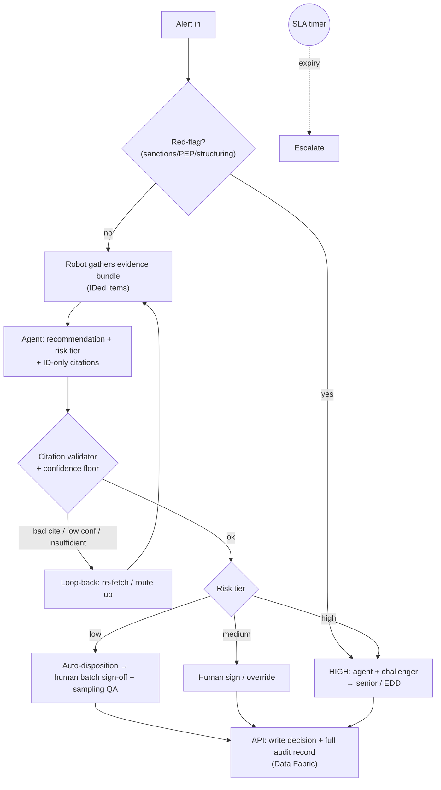
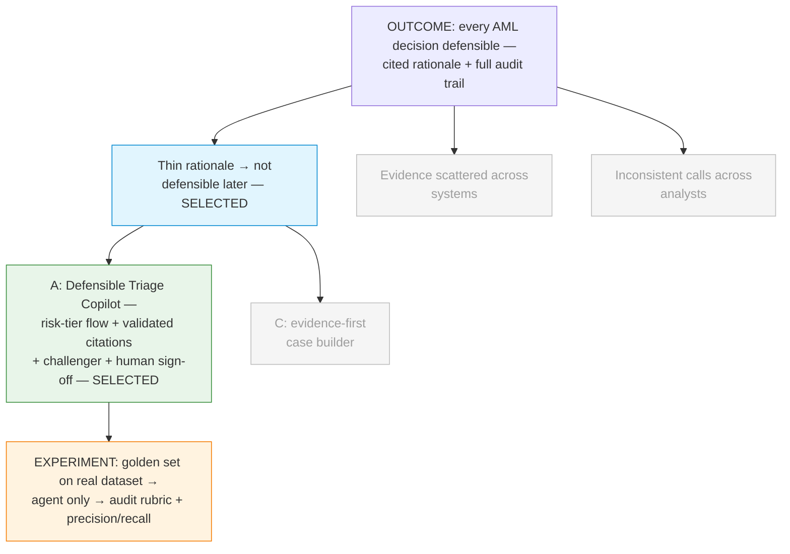

# Discovery Brief: Defensible AML Alert Triage ("Aurora Verdict")

> UiPath AgentHack — **Track 2 (Maestro BPMN)**. Enterprise / central-bank
> supervision use case, grounded in BIS Innovation Hub **Project Aurora**
> (AML) research. Submission deadline: **2026-06-29, 11:45pm EDT** (9 days
> from this brief).
>
> _Updated 2026-06-20 after a `/grill-me` stress-test — the orchestration,
> agent guardrails, build strategy, and data plan below supersede the original
> draft._

## Desired Outcome

Make every suspicious-activity (AML) escalate/close decision **defensible by
construction**: each decision carries a structured, evidence-cited rationale
and a complete, replayable trail from `alert → evidence gathered →
recommendation → human decision → logged outcome`.

Measurable demo targets:

- **Audit-readiness:** ≥90% of triaged alerts produce a full cited narrative
  (call + risk score + *validated* evidence citations) that passes a simple
  audit-readiness rubric — vs. today's thin one-line close-reason.
- **Decision accuracy (hard metric):** report the agent's **precision/recall**
  on its risk-tier calls vs. the public dataset's ground-truth labels — a real
  number, not an eyeballed sample.
- **Time-to-defensible-decision:** the analyst starts from a complete,
  reasoned recommendation instead of a blank case file.
- **Consistency:** one standard applied to every alert regardless of which
  analyst is on shift.

Why this outcome (vs. speed or coverage): regulators and auditors don't reward
throughput — they reward decisions that hold up on review years later.
Defensibility is also the angle that best showcases what Maestro (human-in-the-
loop + full trace) and Claude (structured reasoning with citations) are each
strongest at.

## Opportunity Map

| #   | Opportunity (user problem)                                                                 | Evidence                                                  | Strength | Size                       |
| --- | ------------------------------------------------------------------------------------------ | -------------------------------------------------------- | -------- | -------------------------- |
| 1   | Recorded rationale is too thin to defend later — close/escalate reason is a sentence or two | Well-documented AML industry pain; audit findings        | Strong   | Every analyst, every alert |
| 2   | Evidence is scattered across systems (KYC, transactions, sanctions/PEP, adverse media)      | Industry-wide; gathering eats the time meant for judgment | Strong   | Every analyst, every alert |
| 3   | No consistent standard / no reliable second set of eyes — outcomes vary by who's on shift   | Moderate — known QA bottleneck, harder to quantify       | Moderate | Supervisors / QA function  |

## Selected Opportunity

**#1 — Thin, undefendable rationale.** Selected because it maps most directly
to the chosen outcome (defensibility/audit-readiness), and because solving it
*requires* solving #2 as the means: to write a cited rationale, the agent must
first assemble the complete evidence picture. So #1 absorbs #2. #3
(consistency) is a natural by-product of every alert running through one
standardized, agent-produced recommendation — captured as a secondary benefit.

Deferred, not dropped: #3 as a standalone "consistency metric" story (hard to
prove with mock data in 9 days) stays on the list for a future cycle.

## Solution Candidates

| #   | Solution                                                                                                                                                                       | Riskiest Assumption                                                                                          | PRD |
| --- | ---------------------------------------------------------------------------------------------------------------------------------------------------------------------------- | ----------------------------------------------------------------------------------------------------------- | --- |
| A ✅ | **Defensible Triage Copilot.** A real BPMN flow: risk-tier gateway, agent recommendation with *validated* citations, maker–checker challenger on the high-risk path, human sign-off, full audit log. (Details below.) | Investigators **trust and act on** the agent's cited recommendation, so decisions become more defensible — not a rubber-stamp or an extra review step. | —   |
| C   | **Evidence-first case builder.** Emphasis on wiring many *real* external data sources; recommendation secondary. Deferred — integration-heavy for a 9-day box.                  | Enough real sources can be integrated in 9 days to be convincing.                                            | —   |

> Note: the original "Solution B" (challenger / maker–checker agent) is **no
> longer a detachable stretch** — it has been folded into Solution A as the
> high-risk-path gateway.

### Solution A — orchestration detail (post-grill)

This is a genuine BPMN process, not a linear pipe. Control-flow elements:

- **Risk-tier gateway** routes each alert: `low → auto-disposition`, `medium →
  agent recommendation → human sign/override`, `high → agent + challenger →
  senior / EDD review`.
- **Low-risk is never silently auto-closed.** The agent *auto-dispositions*
  low-risk, but a human stays accountable via **one-click batch sign-off**,
  with a sampled % (and all high-value) pulled for full review.
- **Conservative-by-construction tiering.** Deterministic **red-flag triggers**
  (any sanctions/PEP hit, structuring patterns, watchlist jurisdictions) force
  the high-risk route regardless of the agent; a **confidence floor** sends
  anything the agent isn't strongly confident is low *up* to a human.
  Uncertainty always escalates.
- **Grounded, validated citations.** The robot assembles evidence into a
  structured bundle where each item has a stable ID; the agent may cite only
  those IDs; a validator confirms every cited ID exists and links back to the
  source — any unverifiable cite is **flagged before the human sees it**.
- **Missing-evidence loop-back** — agent says "insufficient data" → robot
  re-fetches / requests info → re-triage.
- **SLA / escalation timer** — no decision within N → escalate.



## Opportunity Solution Tree



## Recommended Experiment

**Test the riskiest assumption before building the full flow:** that the
agent's cited recommendations are genuinely *accurate and audit-defensible*,
not plausible-sounding mush.

- **Data:** a public Kaggle AML dataset as the realistic substrate — **SAML-D**
  (`berkanoztas/synthetic-transaction-monitoring-dataset-aml`) or **IBM
  Transactions for AML** (`ealtman2019/...`) — plus a thin engineered layer that
  assembles the evidence bundle and injects synthetic sanctions/PEP hits (the
  raw data has none). All synthetic; **no real or anonymized-real data**.
  Attribute the license (IBM data is **CDLA-Sharing-1.0**; check SAML-D's
  Kaggle license tab).
- **Golden set:** curate ~8–12 scenarios from it, each engineered to trigger a
  specific branch + demo beat (clean close, red-flag override, caught
  hallucinated citation, maker–checker disagreement, ambiguous escalation).
- **How:** run each through the triage agent's prompt **alone** (before any
  Maestro orchestration), score on a 3-point rubric — *(1) correct call?
  (2) relevant evidence cited and validated? (3) would this survive an audit?* —
  **and** compute **precision/recall** of the agent's tier calls against the
  dataset's ground-truth labels.
- **Who / when:** the team (the lead is at a central bank and can sanity-check
  the narratives); ~1 day.
- **Good looks like:** ≥6/8 golden cases pass all three rubric points, and tier
  precision/recall clears an agreed bar. Pass → build the full BPMN with
  confidence. Fail → fix the agent's reasoning/evidence design first.

## Recommendation

Proceed to **`/prd` for Solution A (Defensible Triage Copilot)** targeting
Opportunity #1, with the experiment above as the first build step.

### Build strategy (9-day clock)

- **Vertical slice first.** Get *one* alert flowing fully end-to-end on
  Automation Cloud — gather → agent rec + validated citations → human sign-off →
  audit log — working by a hard internal date (**Day 5–6**).
- **Then layer the beats** (citation-catch, red-flag override, challenger,
  loop-back, SLA timer) in priority order — each is a ranked backlog item, not a
  commitment.
- **Feature-freeze ~Jun 27**, then it's all video + deck.
- Narrow-but-works beats broad-but-broken.

### UiPath component map (drives the *Platform Usage* score)

Commit to a **core 5, all load-bearing**; add Integration Service as a layered
beat only after the slice works. No token integrations.

- *Maestro BPMN* — the end-to-end orchestration (the spine).
- *Agent Builder (or coded agent)* — the Claude-powered triage agent **and** the
  maker–checker challenger.
- *RPA robot / API Workflow* — evidence gathering + writing the decision record.
- *Action Center (human-in-the-loop task)* — investigator sign / override /
  batch sign-off.
- *Data Fabric / storage* — the audit log + case records.
- *Integration Service* (layered beat) — adverse-media / notification connector.

### Claude bonus evidence (Platform Usage bonus)

The project is **built with Claude Code** via the `uip` CLI — the named
"UiPath for Coding Agents" path. Make it **undeniable in the repo, brief in the
deck, ~15–20s in the video** — proof, not theater:

- `AGENTS.md` / README **"Built with Claude Code"** section listing the actual
  `uip` commands it ran (scaffold → pack → publish).
- A committed **build/command log** (e.g. `docs/build-log.md`).
- One deck slide; one ~15–20s video clip of Claude Code driving `uip`.
- **No `Co-Authored-By` commit trailers** — evidence lives in repo content and
  the video, not commit metadata.
- (Optional second layer: the in-flow triage agent itself can run on a Claude
  model via UiPath — reinforces the story, but the *named* bonus is for the
  coding agent.)

## Decision Log

- **Rejected UiPath's own canned Track 2 examples** (procure-to-pay,
  order-to-cash, collections) — every team will reach for them; wanted a
  differentiated, under-served process.
- **Pivoted into central-bank supervision** based on the user's role (IT at a
  central bank) and request to anchor on BIS research.
- **Chose AML alert triage (BIS Project Aurora)** over cyber-incident intake
  (Raven) and regulatory-return validation (Ellipse) — board-level priority,
  document-rich, lets the agent do real investigative reasoning.
- **Outcome = decision quality / defensibility**, not speed or coverage — best
  fit for a central-bank/regulator audience and for Maestro + Claude's strengths.
- **Selected Opportunity #1 (thin rationale)** — most direct line to the
  outcome; absorbs #2 as the means and yields #3 as a by-product.

**Post-grill decisions (2026-06-20):**

- **Real BPMN, not a pipe** — risk-tier gateway, missing-evidence loop-back, SLA
  timer, maker–checker gateway. Folded the old "Solution B" challenger into the
  core high-risk path.
- **No naive auto-close** — low-risk is agent auto-disposition + human batch
  sign-off + sampling QA, closing the highest-volume governance hole.
- **Citations grounded structurally** — ID-only references into a structured
  evidence bundle + a validator that flags hallucinated cites before the human.
- **Conservative tiering** — deterministic red-flag overrides + confidence
  floor; uncertainty escalates, protecting against the catastrophic false
  negative.
- **Vertical-slice build + ~Jun 27 freeze** — protect against having nothing
  that runs end-to-end on submission day.
- **Public Kaggle dataset (SAML-D / IBM) as substrate** + engineered evidence
  layer + curated golden set; report precision/recall vs ground-truth labels.
- **Core-5 platform footprint used meaningfully**; Integration Service as a
  layered beat — avoid token integrations.
- **Claude evidence via repo content + deck + short video clip; no co-author
  commit trailers.**

## Open Questions

Carry into `/prd`:

- **Audit-ready record schema** — the exact fields the agent writes to (the
  rubric). Undefined and it gates the agent prompt. Define first.
- **Confidence-floor threshold** and the precise **red-flag trigger list** —
  need concrete values.
- **Minimum-viable challenger** — now that it's core, the smallest version that
  still demos convincingly.
- **UiPath Labs / Automation Cloud access + team size (1–4)** — hard external
  dependency; confirm Day 1.
- Which evidence sources are wired vs. mocked for the demo — decide the cut line
  early.

## Accepted Risks / Trade-offs

- Folding the challenger into the core raises build scope; mitigated by the
  vertical-slice + freeze discipline rather than by cutting it.
- Sampling QA (not 100% human review) on the low-risk bucket — a deliberate
  efficiency/defensibility trade, backstopped by red-flag overrides + the
  confidence floor.
```
