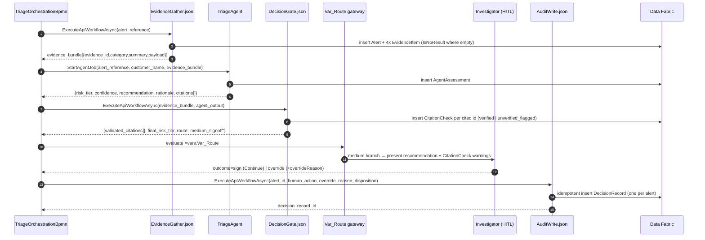

# Core Triage Slice (Recommendation → Sign-off → Log)

**Ticket:** TBD

This feature takes a single medium-risk anti-money-laundering (AML) alert all the way
through: it gathers the full evidence picture into one case file, produces a reasoned
recommendation whose every citation is checked against real gathered evidence, lets an
investigator agree or override it, and writes a complete audit-ready record of the whole
trail. It is the working spine of the epic — the first alert that flows end-to-end — and it
delivers the headline promise that decisions are defensible by construction. The investigator
benefits: instead of starting from a blank case file, they start from a complete, cited
recommendation they can trust because any unverifiable claim has already been flagged.

## User Story

As an AML investigator, I want to open a medium-risk alert that already states the
recommended call, the risk tier, the agent's confidence, and the evidence behind it — with
any unverifiable citation flagged before I read it — so that I can confidently agree or
override in minutes and leave behind a record that holds up under audit.

## Background & Context

**Current state:**

- Investigators receive transaction-monitoring alerts and must decide whether to escalate
  (open an investigation / file a suspicious-activity report) or close them.
- The evidence needed to judge an alert — the customer profile, transaction history,
  sanctions and politically-exposed-person (PEP) screening results, and adverse-media
  indicators — is scattered across separate systems. Pulling it together by hand eats the
  time meant for judgement.
- When a decision is recorded, the rationale is usually a one- or two-sentence close reason.

**Problem:**

- A thin rationale does not survive a regulator or internal auditor reviewing the decision
  months or years later: the reasoning, the evidence relied on, and the approval trail are
  not captured in a way that holds up.
- A generated recommendation is only trustworthy if its supporting claims are real. A
  recommendation that cites evidence which was never actually gathered — a fabricated or
  mistaken reference — is worse than no recommendation, because it looks authoritative while
  being unfounded.
- Without one standard applied to every alert, the same alert can be handled differently
  depending on who is on shift.

## Target User & Persona

- **Who:** An AML investigator (for example, Priya) who triages transaction-monitoring
  alerts day to day and is personally accountable for the escalate/close decision.
- **Context:** Priya works a queue of alerts. For a medium-risk alert she needs to
  understand the case quickly, satisfy herself the recommendation is sound, and either back
  it or correct it — knowing her name and reasoning will be on the record if it is ever
  reviewed.
- **Current workaround:** She opens several systems, copies evidence into a working note,
  forms a judgement, and writes a short close/escalate reason that captures little of the
  reasoning.

## Goals

- For a medium-risk alert, present the investigator with a complete case file: the
  recommended call, the risk tier, the agent's confidence, and the list of cited evidence.
- Guarantee every citation points at evidence that was actually gathered into the case file,
  and flag any citation that cannot be traced to a real evidence item before the
  investigator reads the recommendation.
- Let the investigator sign (agree) or override (disagree), capturing the override reason
  when they disagree.
- Write a single audit-ready decision record that reconstructs the full alert → evidence →
  recommendation → decision → outcome trail.

## Non-Goals

- **Deterministic red-flag and high-risk routing.** Forcing an alert onto the high-risk
  route when a sanctions hit, PEP match, structuring pattern, high-risk jurisdiction, or
  watchlist match fires is handled by the "Red-flag override & conservative tiering" story.
  This story covers the medium-risk path.
- **Independent challenger review.** The second-opinion review on the high-risk path belongs
  to the "Maker–checker challenger" story.
- **Low-risk batch sign-off and sampling.** Bulk clearance of auto-dispositioned low-risk
  alerts belongs to the "Low-risk auto-disposition with batch sign-off & QA" story.
- **Re-fetching missing evidence and automatic re-triage.** A loop-back that gathers more
  evidence and triages again is a deferred backlog beat, not part of this slice.

## User Workflow

> The step-by-step experience from the investigator's perspective.

1. **An alert is waiting.** Priya sees a medium-risk alert in her queue — for example, an
   alert on Meridian Trading Ltd flagged for an unusual pattern of outbound payments. She
   opens it.
2. **The case file is already assembled.** Instead of a blank screen, she sees one case file
   that has pulled together Meridian Trading Ltd's customer profile, recent transaction
   history, the sanctions/PEP screening result, and any adverse-media indicators.
3. **The recommendation is stated up front.** The case file leads with the recommended call
   (escalate or close), the risk tier (medium), the agent's confidence, and a list of the
   specific evidence items the recommendation relied on, each pointing back to where it came
   from in the case file.
4. **Any unverifiable claim is already flagged.** If the recommendation referred to a piece
   of evidence that was not actually gathered into the case file, that reference is shown to
   Priya as flagged and unverified, with a clear warning — so she never has to take a hidden
   claim on faith.
5. **She decides.** Priya reviews the recommendation against the cited evidence and either
   signs (agrees) or overrides. If she overrides, she records her reason.
6. **The decision is logged.** As soon as she decides, a complete audit-ready record is
   written capturing the alert, the assembled evidence and each citation's check status, the
   recommendation and confidence, her decision (who, when, agreed or overridden, and any
   override reason), and the final disposition with its time. She moves on to the next alert.

## Acceptance Criteria

> From the investigator's perspective — what she sees, reviews, and decides.

### Scenario: Investigator reviews a complete recommendation and signs to agree

```gherkin
Given a medium-risk alert on Meridian Trading Ltd is waiting in my queue
  And the case file has gathered Meridian Trading Ltd's customer profile, its
      transaction history, its sanctions and PEP screening result, and its
      adverse-media indicators
  And the recommendation reads "Close — risk tier medium, confidence 78%"
  And every cited evidence item points back to an item actually gathered into the
      case file
When I open the alert
Then I see the recommended call, the risk tier, the confidence, and the list of
     cited evidence before any blank work area
  And I see no unverified-citation warnings
When I sign to agree with the recommendation
Then I see the alert recorded as closed with my name as the accountable decision-maker
  And I see confirmation that an audit-ready decision record has been written
```

### Scenario: Investigator overrides the recommendation and records a reason

```gherkin
Given a medium-risk alert on Northwind Logistics Inc is waiting in my queue
  And the recommendation reads "Close — risk tier medium, confidence 71%"
  And the cited evidence includes a sequence of seven outbound payments of
      RM24,000 each to the same counterparty over five days
When I open the alert and review the cited evidence
  And I disagree because the payment pattern looks like deliberate structuring
  And I choose to override the recommendation to "Escalate"
Then I am required to record an override reason before the override is accepted
When I enter the override reason "Repeated payments just under the reporting
     threshold to one counterparty — consistent with structuring; escalating for
     investigation"
Then I see the alert recorded as escalated with my name as the accountable
     decision-maker
  And I see that my override reason has been captured
  And I see confirmation that an audit-ready decision record has been written
```

### Scenario: An unverifiable citation is caught and flagged before the investigator reads the recommendation

```gherkin
Given a medium-risk alert on Cedar Imports Ltd is waiting in my queue
  And the case file has gathered Cedar Imports Ltd's customer profile, its
      transaction history, and its sanctions and PEP screening result
  And no adverse-media indicator was gathered for Cedar Imports Ltd
  And the recommendation cites "a 2024 news report alleging bribery by Cedar
      Imports Ltd" as supporting evidence
  And that cited news report cannot be traced to any evidence item in the case file
When I open the alert
Then I see the recommendation with the bribery-report citation clearly marked as
     unverified and not found in the gathered evidence
  And I see a warning that I should not rely on the flagged citation
  And I can still review every citation that was confirmed against the case file
When I decide on the alert
Then the decision record shows the bribery-report citation with a failed
     citation-check status alongside the citations that passed
```

### Scenario: An investigator cannot complete a decision without one valid, accountable action

```gherkin
Given a medium-risk alert on Meridian Trading Ltd is open in front of me
  And the recommendation and cited evidence are displayed
When I try to leave the alert without either signing or overriding
Then the alert stays undecided and open
  And no disposition and no decision record are written for it
```

### Scenario Outline: Whatever the outcome, a complete audit-ready record is written

```gherkin
Given a medium-risk alert on <customer> with recommendation "<recommendation>"
      and confidence <confidence> is open in front of me
When I <decision> the recommendation, with reason "<reason>"
Then a decision record is written that reconstructs the full trail from alert
     received, through the gathered evidence and each citation's check status, to
     the recommendation, my decision, and the final disposition
  And the record names me, Priya, as the accountable decision-maker with the date
      and time of my decision
  And the record states the final disposition as "<disposition>"

Examples:
  | customer              | recommendation | confidence | decision | reason                                                                 | disposition |
  | Meridian Trading Ltd  | Close          | 78%        | sign     | (none — agreed with recommendation)                                    | Closed      |
  | Northwind Logistics Inc | Close        | 71%        | override | Payments just under the reporting threshold suggest structuring        | Escalated   |
  | Harbour Freight Co    | Escalate       | 64%        | sign     | (none — agreed with recommendation)                                    | Escalated   |
```

### Scenario Outline: The citation-check status is shown for each cited item

```gherkin
Given a medium-risk alert on Cedar Imports Ltd is open in front of me
  And the recommendation cites the evidence item "<cited item>"
When the citation is checked against the gathered case file
Then I see the cited item marked as "<check status>"

Examples:
  | cited item                                              | check status        |
  | Sanctions and PEP screening returned no match           | Verified            |
  | Three large cash deposits in the past 30 days           | Verified            |
  | A 2024 news report alleging bribery (not in case file)  | Unverified / flagged |
```

## Business Rules & Constraints

- **The case file is assembled before the investigator sees the alert.** Every medium-risk
  alert presented to the investigator already contains the four evidence categories that
  could be gathered — customer profile, transaction history, sanctions/PEP screening result,
  and adverse-media indicators — so the investigator never starts from a blank file. Where a
  category genuinely returned nothing (for example, no adverse media found), that is shown as
  an explicit "no result" rather than left missing.
- **A recommendation may cite only gathered evidence.** The recommendation may reference only
  evidence items that were actually assembled into the case file. Every citation is checked
  against the gathered evidence.
- **Unverifiable citations are flagged, never silent.** Any citation that cannot be traced to
  a real gathered evidence item is shown to the investigator as flagged and unverified,
  before she reads the recommendation as trustworthy. No unverifiable citation reaches the
  investigator unflagged, and the failed check status is preserved in the decision record.
- **A human is accountable for every disposition.** A medium-risk alert is dispositioned only
  when the investigator signs or overrides. The investigator's name, the date and time, and
  whether she agreed or overrode are recorded. No medium-risk alert is closed or escalated
  with no human in the chain.
- **An override always carries a reason.** The investigator cannot override the
  recommendation without recording why; signing to agree needs no reason.
- **One decision record per alert, with the full field set.** Each dispositioned alert
  produces a single audit-ready record containing: the alert reference and date; the
  customer/account reference; the risk tier and the agent's confidence; the recommendation
  (escalate or close); the list of cited evidence with each item's source and citation-check
  status; the human decision (who, when, agreed or overridden, and the override reason); and
  the final disposition with its time. The record reconstructs the full alert → evidence →
  recommendation → decision → outcome trail.

## Success Metrics

- **Audit-readiness:** the medium-risk alert produces a full cited narrative — the call, the
  risk tier, and validated evidence citations — that passes the audit-readiness rubric,
  versus today's one-line close reason.
- **Citation integrity:** zero unverifiable citations reach the investigator unflagged; every
  flagged citation is preserved with its failed check status in the decision record.
- **Defensibility coverage:** every dispositioned medium-risk alert has a named human
  accountable in its record.
- **Time-to-defensible-decision:** the investigator starts from a complete, reasoned
  recommendation rather than a blank case file (demonstrated qualitatively on the slice).

## Dependencies

- **Golden-set accuracy validation** — the agent's recommendations must be scored against a
  realistic dataset with known answers, so the team trusts the reasoning is accurate before
  routing it to an investigator. This story builds on that proof.
- **A realistic synthetic alert with an assembled evidence bundle** — including synthetic
  sanctions/PEP and adverse-media indicators — so a medium-risk alert can be taken
  end-to-end. No real or anonymized-real customer data is used.

## Open Questions

- [x] ~~What fields make the decision record audit-ready?~~ — **Resolved:** the field set is
  fixed by the epic's shared business rules (alert reference and date; customer/account
  reference; risk tier and confidence; recommendation; cited evidence with source and
  check status; human decision with override reason; final disposition and time). For this
  medium-risk story the challenger-outcome and red-flag-trigger fields are present but not
  exercised — they belong to the high-risk and red-flag stories.
- [x] ~~When an evidence category returns nothing, is that a gap or a result?~~ —
  **Resolved:** a category that genuinely returns nothing (for example, no adverse media) is
  shown as an explicit "no result," not a missing item. Re-fetching genuinely incomplete
  evidence is a deferred backlog beat outside this slice.
- [x] ~~Does signing to agree require a written reason like an override does?~~ —
  **Resolved:** no. Overriding requires a recorded reason; signing to agree does not.

---

> **Technical sections (appended by `prd-refine`).** Everything above this line is the
> product-owner-approved business content and is unchanged. Everything below is the
> implementation contract for a developer or a `/build` subagent. This story is the
> **vertical-slice spine**: it stands up the solution, the agent, the three API Workflows,
> the five Data Fabric entities this slice writes, and the medium-path BPMN flow. Later
> stories (red-flag override, challenger, low-risk batch) extend this scaffolding rather
> than re-create it. All shared entities, contracts, error codes, and conventions live in
> the epic overview's **# Technical Architecture (Shared)** section
> ([spec.md](spec.md)) and are referenced — never redefined — here.

## Functional Requirements

| # | Requirement | Detail | Maps to AC |
| - | ----------- | ------ | ---------- |
| FR-1 | Evidence bundle assembled before the human sees the alert | `EvidenceGatherApi/EvidenceGather.json` runs first in the BPMN and must produce all four `EvidenceItem` categories (`customer_profile`, `transaction_history`, `screening`, `adverse_media`) before the `userTask` is reachable. A category that genuinely returns nothing is written as an `EvidenceItem` with `IsNoResult = true` (`EVIDENCE_NO_RESULT`), never omitted. | Business Rules §1; Workflow 2 |
| FR-2 | Recommendation cites only gathered ids | The agent's `citations[]` may contain only `evidence_id` strings present in the bundle handed to it. Enforced by the system-prompt output contract and **backstopped** by the deterministic validator (FR-3); the LLM is never trusted to self-police. | Business Rules §2 |
| FR-3 | Unverifiable citations flagged before the human | `DecisionGateApi/DecisionGate.json` `JsInvoke` validator checks **every** cited id against the bundle's stable `EvidenceId` set: present → `verified`; absent → `unverified_flagged` (`CITATION_UNVERIFIED`). One `CitationCheck` row per cited id. The HITL read-only `CitationCheck` field surfaces every flagged citation with a warning before the investigator reads the recommendation as trustworthy. | Business Rules §3; Workflow 4; "unverifiable citation" scenario |
| FR-4 | One decision only, via sign or override (atomicity) | The medium-path disposition exists only as the result of the `Actions.HITL` `userTask` completing with outcome `sign` or `override`. If the task is abandoned (never completed), **no `DecisionRecord` is written and no `FinalDisposition` is set** — the alert stays open. `AuditWriteApi` is wired downstream of the `userTask` only, so an abandoned task cannot reach it. | Business Rules §4; "cannot complete without one valid action" scenario |
| FR-5 | Override always carries a reason | The `override` outcome requires the `overrideReason` output text field; an empty value raises `OVERRIDE_REASON_REQUIRED` and the task cannot complete. `sign` requires no reason. | Business Rules §5; "override" scenario |
| FR-6 | Exactly one `DecisionRecord` per alert (idempotency) | `AuditWriteApi/AuditWrite.json` queries for an existing `DecisionRecord` whose `AlertLink` matches the alert's `Id` before inserting; if one exists, it returns the existing record id without inserting (re-runs do not double-write). Combined with the append-only convention (no update/delete), each alert reconstructs to exactly one record. | Business Rules §6; "complete record" scenario outline |
| FR-7 | Confidence floor (this story's gate scope) | `DecisionGate` applies the confidence-floor check only (a `low` call < 85 routes to a human → `medium_signoff`; `CONFIDENCE_BELOW_FLOOR`). **Red-flag evaluation is out of scope here** and is added to the same gate by the red-flag story. For this slice every alert resolves to `Var_Route = "medium_signoff"`. | Non-Goals; shared gate rules |

## Permissions & Security

- **Investigator role for the Action Center task.** The `Actions.HITL` `userTask` is assigned
  to the named investigator user/group (demo: Priya, in the single `AuroraVerdict` folder).
  Assignment is set on the `userTask` (assignee binding) so only an authorised investigator
  can sign/override; the accountable name is read back from the completed task into
  `DecisionRecord.DecisionMakerName`. No anonymous or unassigned disposition is possible.
- **Input validation on API Workflow inputs.** Each workflow's first `WorkflowStart` step is
  followed by a `JsInvoke` guard that validates `$workflow.input`: `EvidenceGather` requires a
  non-empty `alert_reference` matching `^ALERT-\d{4}-\d{4}$` and a dataset row that resolves
  (no row → `EVIDENCE_NO_RESULT` is reserved for empty *categories*, while a wholly missing
  alert raises a hard `Response` error, not a partial bundle); `DecisionGate` requires
  `evidence_bundle[]` and `agent_output` to be present and well-formed JSON; `AuditWrite`
  requires `alert_id` (UUID), `human_action ∈ {signed_agree, override}`, and a non-empty
  `override_reason` when `human_action = override` (`OVERRIDE_REASON_REQUIRED`).
- **The LLM cannot introduce evidence (validator backstop).** Even if prompt injection in
  synthetic evidence text coerces the agent into citing a fabricated id (e.g. Cedar's invented
  bribery report), the deterministic `DecisionGate` validator marks it `unverified_flagged`
  and the human sees the warning — the agent's output never silently becomes truth. The
  `prompt_injection` and `user_prompt_attacks` guardrails are enabled on `TriageAgent` as
  defence-in-depth (confirm `Available` via `uip agent guardrails list`).
- **Threat model:** see the overview **## Cross-cutting Threat Model**. This story adds the
  first concrete attack surface instances (one Action Center form, three API Workflow inputs,
  one agent prompt); deltas are itemised in the Threat Model Checklist below.

## System Design

The medium-path slice (this story) wires these components in the BPMN spine:

| Step | BPMN node | Type | Calls |
| ---- | --------- | ---- | ----- |
| 1 | EvidenceGather | `bpmn:serviceTask` | `Orchestrator.ExecuteApiWorkflowAsync` → `EvidenceGatherApi/EvidenceGather.json` |
| 2 | TriageAgent | `bpmn:serviceTask` | `Orchestrator.StartAgentJob` → `TriageAgent/agent.json` |
| 3 | DecisionGate | `bpmn:serviceTask` | `Orchestrator.ExecuteApiWorkflowAsync` → `DecisionGateApi/DecisionGate.json` (citation validator + confidence floor only) |
| 4 | Route | `bpmn:exclusiveGateway` on `=vars.Var_Route` | outgoing `bpmn:sequenceFlow` with `bpmn:conditionExpression` `=vars.Var_Route == "medium_signoff"` |
| 5 | HITL sign/override | `bpmn:userTask` | `Actions.HITL` (QuickForm authored in the `.bpmn`) |
| 6 | AuditWrite | `bpmn:serviceTask` | `Orchestrator.ExecuteApiWorkflowAsync` → `AuditWriteApi/AuditWrite.json` |



**Tradeoffs.** Low-code Agent Builder over a coded agent ([ADR 001](../../adr/001-low-code-agent-builder-for-triage-and-challenger.md))
keeps the reasoning step declarative (`outputSchema` + guardrails) for a solo build.
API Workflow + Data Fabric over coded services ([ADR 002](../../adr/002-api-workflow-and-data-fabric-for-automation-and-audit-store.md))
puts the deterministic gate and the audit store on the same low-code substrate so the gate
(citation validity, confidence floor) is auditable and never delegated to the LLM.

## Threat Model Checklist

| Dimension | This story's delta |
| --------- | ------------------ |
| **Data classification** | N/A — see overview. Customers (Meridian Trading Ltd, Northwind Logistics Inc, Cedar Imports Ltd) and all evidence are synthetic; no PII, no real/anonymized-real data. |
| **Attack surface** | First concrete instances of the overview's surfaces: one Action Center form (`Actions.HITL` QuickForm — human input fields `overrideReason`); three API Workflow inputs (validated per Permissions & Security); one agent prompt (synthetic evidence text is attacker-controlled in principle). No new public routes. |
| **Authn/authz** | N/A — see overview, plus: the `userTask` is assigned to the named investigator; the disposition cannot be set by an unassigned actor; `DecisionMakerName` is read from the completed task, not free-typed. |
| **Prompt injection / LLM tampering** | `prompt_injection` + `user_prompt_attacks` guardrails enabled on `TriageAgent`; the `DecisionGate` citation validator is the hard backstop (a hallucinated/injected citation → `unverified_flagged`, surfaced to the human). The gate only ever escalates (confidence floor), never resolves doubt downward. |
| **Dependencies** | N/A — see overview. This story uses the `uipath-uipath-dataservice` IntSvc connector and the public SAML-D dataset (license attributed); no new third-party packages. |

## API Design

> All paths are under `AuroraVerdict/`. API Workflows follow the shared contract: each `do[]`
> starts with `WorkflowStart`; inputs read via `$workflow.input.<name>`; logic in `JsInvoke`;
> Data Fabric reached via the `uipath-uipath-dataservice` connector; a final `Response`
> returns structured output. Run/validate with
> `uip api-workflow run <file> --input-arguments '{...}'` / `uip api-workflow validate <file>`.

### `EvidenceGatherApi/EvidenceGather.json`

Request:
```json
{ "alert_reference": "ALERT-2026-0142" }
```
Response (Meridian Trading Ltd — note the explicit no-result adverse-media item):
```json
{
  "alert_id": "8f2c1a90-3b44-4e7d-9a01-7c5e2d6f0011",
  "alert_reference": "ALERT-2026-0142",
  "customer_name": "Meridian Trading Ltd",
  "evidence_bundle": [
    { "evidence_id": "ALERT-2026-0142#EV-001", "category": "customer_profile",
      "summary": "Incorporated 2014; licensed commodities trader; CDD refreshed 2025-11.",
      "source_ref": "CDD/Meridian", "is_no_result": false },
    { "evidence_id": "ALERT-2026-0142#EV-002", "category": "transaction_history",
      "summary": "Three large cash deposits in the past 30 days; values RM40k–RM90k.",
      "source_ref": "TXN/Meridian", "is_no_result": false },
    { "evidence_id": "ALERT-2026-0142#EV-003", "category": "screening",
      "summary": "Sanctions and PEP screening returned no match.",
      "source_ref": "SCREEN/Meridian", "is_no_result": false },
    { "evidence_id": "ALERT-2026-0142#EV-004", "category": "adverse_media",
      "summary": "No adverse media found.",
      "source_ref": "MEDIA/Meridian", "is_no_result": true }
  ]
}
```

### `DecisionGateApi/DecisionGate.json` (this story: citation validator + confidence floor only)

Request:
```json
{
  "alert_id": "8f2c1a90-3b44-4e7d-9a01-7c5e2d6f0011",
  "evidence_bundle": [ { "evidence_id": "ALERT-2026-0142#EV-001" }, { "evidence_id": "ALERT-2026-0142#EV-002" }, { "evidence_id": "ALERT-2026-0142#EV-003" }, { "evidence_id": "ALERT-2026-0142#EV-004" } ],
  "agent_output": { "risk_tier": "medium", "confidence": 78, "recommendation": "close",
    "citations": ["ALERT-2026-0142#EV-002", "ALERT-2026-0142#EV-003"] }
}
```
Response (Meridian — all verified, medium route):
```json
{
  "validated_citations": [
    { "evidence_id": "ALERT-2026-0142#EV-002", "outcome": "verified" },
    { "evidence_id": "ALERT-2026-0142#EV-003", "outcome": "verified" }
  ],
  "has_unverified": false,
  "final_risk_tier": "medium",
  "route": "medium_signoff"
}
```
Response (Cedar Imports Ltd — invented bribery-report citation flagged):
```json
{
  "validated_citations": [
    { "evidence_id": "ALERT-2026-0488#EV-003", "outcome": "verified" },
    { "evidence_id": "ALERT-2026-0488#EV-009", "outcome": "unverified_flagged" }
  ],
  "has_unverified": true,
  "final_risk_tier": "medium",
  "route": "medium_signoff"
}
```
> `ALERT-2026-0488#EV-009` is the agent-fabricated "2024 news report alleging bribery" id; it
> is not in Cedar's bundle (Cedar gathered customer_profile, transaction_history, screening and
> a no-result adverse_media item only), so the validator returns `unverified_flagged`
> (`CITATION_UNVERIFIED`). Note: red-flag evaluation is **not** performed here — `final_risk_tier`
> echoes the agent's tier passed through the confidence floor, and `route` is always
> `medium_signoff` in this slice.

### `AuditWriteApi/AuditWrite.json`

Request (Northwind Logistics Inc — override to escalate):
```json
{
  "alert_id": "1c0d77e2-55aa-4b10-8e22-9f3a1b6c0042",
  "final_risk_tier": "medium",
  "original_proposed_tier": "medium",
  "route_taken": "medium_signoff",
  "decision_maker_name": "Priya",
  "human_action": "override",
  "override_reason": "Repeated payments just under the reporting threshold to one counterparty — consistent with structuring; escalating for investigation",
  "decision_timestamp": "2026-06-20T09:14:00+08:00",
  "final_disposition": "escalated",
  "disposition_timestamp": "2026-06-20T09:14:02+08:00"
}
```
Response:
```json
{ "decision_record_id": "a77b1e34-9c52-4d8e-bb20-0f5e7c3d9981", "was_existing": false }
```
> Idempotency: on a re-run with the same `alert_id`, `AuditWrite` returns the existing
> `decision_record_id` with `"was_existing": true` and inserts nothing. `DecisionRecord` is
> never updated or deleted (append-only). For a `sign` decision, `human_action = "signed_agree"`,
> `override_reason` is omitted, and `final_disposition = "closed"` (Meridian).

### TriageAgent I/O (`TriageAgent/agent.json` → `outputSchema`)

Input (handed by `Orchestrator.StartAgentJob`):
```json
{
  "alert_reference": "ALERT-2026-0142",
  "customer_name": "Meridian Trading Ltd",
  "evidence_bundle": [
    { "evidence_id": "ALERT-2026-0142#EV-002", "category": "transaction_history", "summary": "Three large cash deposits in the past 30 days.", "payload": "{...}" },
    { "evidence_id": "ALERT-2026-0142#EV-003", "category": "screening", "summary": "Sanctions and PEP screening returned no match.", "payload": "{...}" }
  ]
}
```
Output (structured, conforms to overview's `outputSchema`):
```json
{
  "risk_tier": "medium",
  "confidence": 78,
  "recommendation": "close",
  "rationale": "Cash deposit pattern consistent with a licensed commodities trader; clean screening; no adverse media.",
  "citations": ["ALERT-2026-0142#EV-002", "ALERT-2026-0142#EV-003"]
}
```

### HITL task field schema + outcomes (`Actions.HITL` `userTask` in the `.bpmn`)

`inputs.schema.fields[]`:
```json
[
  { "id": "recommendation", "label": "Recommended call", "type": "text", "direction": "input" },
  { "id": "riskTier",       "label": "Risk tier",        "type": "text", "direction": "input" },
  { "id": "confidence",     "label": "Agent confidence (%)", "type": "number", "direction": "input" },
  { "id": "rationale",      "label": "Rationale",        "type": "text", "direction": "input" },
  { "id": "citationCheck",  "label": "Citation check (verified / unverified_flagged)", "type": "text", "direction": "input" },
  { "id": "unverifiedWarning", "label": "⚠ Unverified citations — do not rely on flagged items", "type": "text", "direction": "input" },
  { "id": "overrideReason", "label": "Override reason (required if overriding)", "type": "text", "direction": "output" }
]
```
`outcomes[]`:
```json
[
  { "id": "sign",     "name": "Sign — agree with recommendation", "isPrimary": true, "action": "Continue" },
  { "id": "override", "name": "Override",                          "action": "End", "requires": ["overrideReason"] }
]
```
Read-only fields bind to upstream vars (`recommendation`, `riskTier`, `confidence`,
`rationale` from the agent output; `citationCheck`/`unverifiedWarning` from the gate's
`validated_citations`/`has_unverified`). Runtime read-back:
`$vars.<HitlNodeId>.status` = the chosen outcome id; `$vars.<HitlNodeId>.output.overrideReason`
= the human-entered reason. `overrideReason` empty on `override` → `OVERRIDE_REASON_REQUIRED`.

### Error table

| Code | Message | Surfaced where |
| ---- | ------- | -------------- |
| `CITATION_UNVERIFIED` | "Cited evidence id not found in gathered bundle; flagged for review." | `DecisionGate` → `CitationCheck.CheckOutcome = unverified_flagged`, shown in HITL `citationCheck`/`unverifiedWarning`, preserved in record |
| `OVERRIDE_REASON_REQUIRED` | "An override reason is required before the override can be accepted." | `Actions.HITL` (override outcome with empty `overrideReason`); `AuditWrite` input guard |
| `EVIDENCE_NO_RESULT` | "Evidence category returned no result (explicit, not missing)." | `EvidenceGather` → `EvidenceItem.IsNoResult = true` (e.g. Meridian/Cedar adverse_media) |
| `CONFIDENCE_BELOW_FLOOR` | "Low-risk call below 85% confidence routed to a human." | `DecisionGate` confidence-floor routing (gate scope of this story) |

## Data Model & Migrations

This story stands up five of the seven shared entities (defined in the overview's
**## Shared Data Model**): `Alert`, `EvidenceItem`, `AgentAssessment`, `CitationCheck`,
`DecisionRecord`. `RedFlagTrigger` and `BatchSignoff` are created by later stories. Create each
with `uip df entities create "<Name>" --body '{...}' --output json`. The `--body` shape (fields
beyond the system `Id`/`CreatedBy`/`CreateTime`/`UpdatedBy`/`UpdateTime`):

```jsonc
// Alert
{ "displayName": "Alert", "fields": [
  { "name": "AlertReference", "dataType": "STRING", "isUnique": true },
  { "name": "AlertDate", "dataType": "DATE" },
  { "name": "CustomerReference", "dataType": "STRING" },
  { "name": "CustomerName", "dataType": "STRING" },
  { "name": "AccountReference", "dataType": "STRING" },
  { "name": "AggregateAmountMYR", "dataType": "DECIMAL" } ] }

// EvidenceItem
{ "displayName": "EvidenceItem", "fields": [
  { "name": "EvidenceId", "dataType": "STRING", "isUnique": true },
  { "name": "AlertLink", "dataType": "RELATIONSHIP", "referenceEntity": "Alert" },
  { "name": "EvidenceCategory", "dataType": "CHOICE_SET_SINGLE",
    "choiceSet": ["customer_profile", "transaction_history", "screening", "adverse_media"] },
  { "name": "Summary", "dataType": "MULTILINE_TEXT" },
  { "name": "SourceRef", "dataType": "STRING" },
  { "name": "PayloadJson", "dataType": "MULTILINE_TEXT" },
  { "name": "IsNoResult", "dataType": "BOOLEAN" } ] }

// AgentAssessment
{ "displayName": "AgentAssessment", "fields": [
  { "name": "AlertLink", "dataType": "RELATIONSHIP", "referenceEntity": "Alert" },
  { "name": "ProposedRiskTier", "dataType": "CHOICE_SET_SINGLE", "choiceSet": ["low","medium","high"] },
  { "name": "Confidence", "dataType": "INTEGER" },
  { "name": "Recommendation", "dataType": "CHOICE_SET_SINGLE", "choiceSet": ["escalate","close"] },
  { "name": "Rationale", "dataType": "MULTILINE_TEXT" },
  { "name": "CitedEvidenceIds", "dataType": "MULTILINE_TEXT" },
  { "name": "ModelName", "dataType": "STRING" } ] }

// CitationCheck
{ "displayName": "CitationCheck", "fields": [
  { "name": "AlertLink", "dataType": "RELATIONSHIP", "referenceEntity": "Alert" },
  { "name": "CitedEvidenceId", "dataType": "STRING" },
  { "name": "CheckOutcome", "dataType": "CHOICE_SET_SINGLE", "choiceSet": ["verified","unverified_flagged"] },
  { "name": "ResolvedEvidenceLink", "dataType": "RELATIONSHIP", "referenceEntity": "EvidenceItem" } ] }

// DecisionRecord (append-only by convention)
{ "displayName": "DecisionRecord", "fields": [
  { "name": "AlertLink", "dataType": "RELATIONSHIP", "referenceEntity": "Alert" },
  { "name": "FinalRiskTier", "dataType": "CHOICE_SET_SINGLE", "choiceSet": ["low","medium","high"] },
  { "name": "TierWasForced", "dataType": "BOOLEAN" },
  { "name": "OriginalProposedTier", "dataType": "CHOICE_SET_SINGLE", "choiceSet": ["low","medium","high"] },
  { "name": "RouteTaken", "dataType": "CHOICE_SET_SINGLE", "choiceSet": ["low_batch","medium_signoff","high_challenger"] },
  { "name": "ChallengerOutcome", "dataType": "CHOICE_SET_SINGLE", "choiceSet": ["not_applicable","agreed","disagreed"] },
  { "name": "ChallengerDispute", "dataType": "MULTILINE_TEXT" },
  { "name": "DecisionMakerName", "dataType": "STRING" },
  { "name": "HumanAction", "dataType": "CHOICE_SET_SINGLE", "choiceSet": ["signed_agree","override"] },
  { "name": "OverrideReason", "dataType": "MULTILINE_TEXT" },
  { "name": "DecisionTimestamp", "dataType": "DATETIME_WITH_TZ" },
  { "name": "FinalDisposition", "dataType": "CHOICE_SET_SINGLE", "choiceSet": ["closed","escalated","sent_to_edd"] },
  { "name": "DispositionTimestamp", "dataType": "DATETIME_WITH_TZ" },
  { "name": "WasPulledForReview", "dataType": "BOOLEAN" } ] }
```

Notes:
- **CHOICE_SET value-by-NumberId.** `uip df records insert`/`update` write `CHOICE_SET_SINGLE`
  fields by the integer `NumberId` assigned to each choice value at create time — not the
  string label. After `entities create`, resolve the mapping with
  `uip df entities get "<Name>" --output json` and write the matching `NumberId` (e.g. for
  `DecisionRecord.HumanAction`, `signed_agree`→its NumberId, `override`→its NumberId).
- **Append-only `DecisionRecord`.** Inserts only; never `uip df records update`/`delete` on it.
- **Relationships** (`AlertLink`, `ResolvedEvidenceLink`) store the parent record's `Id` UUID.
  For this slice `DecisionRecord` leaves `TierWasForced=false`, `ChallengerOutcome=not_applicable`,
  `ChallengerDispute`/`BatchSignoffLink` null, `WasPulledForReview=false` (those columns are
  populated by later stories).
- `DecisionRecord.BatchSignoffLink` (overview) depends on `BatchSignoff`, which the low-risk
  batch story creates; omit it from this story's `DecisionRecord` create body and add it in that
  story to avoid a forward reference.

## Architecture Notes

- **This is the spine others extend.** The solution, `TriageAgent`, the three API Workflows,
  the five entities, and the medium-path BPMN flow stand up here. The red-flag story extends
  `DecisionGate` (red-flag evaluation, `RedFlagTrigger`) and adds the high gateway branch; the
  challenger story adds `ChallengerAgent` and the high-path nodes; the low-risk story adds
  `BatchSignoff` and the low branch. None re-create the scaffolding.
- **CLI-derived files are not hand-edited.** `bindings_v2.json`, `entry-points.json`,
  `operate.json`, `package-descriptor.json`, and the solution `.uipx` manifest are produced and
  reconciled by `uip … refresh` / `uip solution resources refresh` — never edited by hand
  (overview Global Negative Constraints). The model-authored sources of record are the `.bpmn`,
  the two `agent.json` files, and the three API Workflow `*.json`.
- **Integration points.** Studio Web (agent eval runs and Maestro debug); the Data Fabric
  Integration Service connector `uipath-uipath-dataservice` (all entity CRUD from the API
  Workflows). One tenant, one folder (`AuroraVerdict`) for the demo.

## Implementation Plan

> Sizes: S ≤ ~2h, M ≈ half-day, L ≈ full day. INDEPENDENT tasks can be built in parallel once
> their inputs exist; the BPMN wiring is SEQUENTIAL after the components it references exist.

| # | Sub-task | Files / commands | Size | Dependency |
| - | -------- | ---------------- | ---- | ---------- |
| 1 | Initialise the solution | `uip solution init "AuroraVerdict" --output json` (fallback `uip solution new` if `unknown command`) | S | SEQUENTIAL (first) |
| 2 | Scaffold the agent | `uip agent init "AuroraVerdict/TriageAgent" --output json`; `uip solution project add ./AuroraVerdict/TriageAgent` | S | SEQUENTIAL (after 1) |
| 3 | Create the 5 Data Fabric entities | `uip df entities create` for `Alert`, `EvidenceItem`, `AgentAssessment`, `CitationCheck`, `DecisionRecord` (bodies above); then `uip df entities get` each to capture CHOICE_SET NumberIds | M | INDEPENDENT (after 1; EvidenceItem before CitationCheck for the relationship) |
| 4 | Author `EvidenceGather.json` | `AuroraVerdict/EvidenceGatherApi/EvidenceGather.json` — `WorkflowStart` → input guard → CSV parse `JsInvoke` → bundle assembly with stable `EvidenceId`s + `IsNoResult` → insert `Alert`+`EvidenceItem`s via `uipath-uipath-dataservice` → `Response` | L | INDEPENDENT (after 3) |
| 5 | Author `DecisionGate.json` (citation validator + confidence floor only) | `AuroraVerdict/DecisionGateApi/DecisionGate.json` — `WorkflowStart` → input guard → citation validator `JsInvoke` (every cited id ∈ bundle?) → insert `CitationCheck` rows → confidence-floor route `JsInvoke` (always `medium_signoff` here) → `Response`. No red-flag logic. | L | INDEPENDENT (after 3) |
| 6 | Author `TriageAgent/agent.json` | `AuroraVerdict/TriageAgent/agent.json` — system prompt with the ID-only citation output contract; `outputSchema` = `{risk_tier, confidence, recommendation, rationale, citations[]}`; enable `prompt_injection` + `user_prompt_attacks` guardrails; model via `uip agent model list` (do not hardcode) | M | INDEPENDENT (after 2) |
| 7 | Author `AuditWrite.json` | `AuroraVerdict/AuditWriteApi/AuditWrite.json` — `WorkflowStart` → input guard (override reason required) → idempotency query (existing `DecisionRecord` for `alert_id`?) → conditional insert (CHOICE_SET by NumberId) → `Response` | M | INDEPENDENT (after 3) |
| 8 | Author the `.bpmn` medium slice + sign/override `userTask` | `AuroraVerdict/TriageOrchestrationBpmn/TriageOrchestrationBpmn.bpmn` — start → EvidenceGather `serviceTask` → TriageAgent `serviceTask` → DecisionGate `serviceTask` → `exclusiveGateway` on `=vars.Var_Route` → medium `sequenceFlow` (`=vars.Var_Route == "medium_signoff"`) → `Actions.HITL` `userTask` (field schema + sign/override outcomes above) → AuditWrite `serviceTask` → end | L | SEQUENTIAL (after 4–7 exist) |
| 9 | Reconcile + package + deploy | `uip solution resources refresh`; `uip agent validate`; `uip api-workflow validate <each>`; `uip maestro bpmn validate <bpmn>`; `uip solution pack ./AuroraVerdict ./output -v <ver>`; `uip solution publish`; `uip solution deploy run …` | M | SEQUENTIAL (last) |

## Negative Constraints

- Do **not** implement red-flag evaluation, the challenger, or batch sign-off here — those are
  the red-flag, maker–checker, and low-risk-batch stories. `DecisionGate` in this story does the
  citation validator + confidence floor **only**; `RedFlagTrigger` and `BatchSignoff` entities are
  not created here.
- Do **not** let the LLM decide citation validity (or red flags / the confidence floor) — the
  deterministic `DecisionGate` validator is authoritative (overview Global Negative Constraints).
- Do **not** hand-edit CLI-derived files (`bindings_v2.json`, `entry-points.json`, `operate.json`,
  `package-descriptor.json`, the `.uipx` manifest).
- Do **not** `update` or `delete` `DecisionRecord` rows — append-only by convention; idempotency
  is achieved by the pre-insert existence query, not by overwriting.
- Do **not** use real or anonymized-real data; do **not** auto-file a regulatory report (the
  system recommends, the human disposes).

## Test Scenarios

> Implementation-level checks against the written records, using the story's own customers.

1. **Meridian close → sign (happy path).** Run the medium path for `ALERT-2026-0142`
   (Meridian Trading Ltd, recommendation `close`, confidence 78, all citations verified);
   complete the HITL with outcome `sign`. **Assert:** exactly one `DecisionRecord` for the
   alert with `HumanAction = signed_agree`, `FinalDisposition = closed`, `DecisionMakerName`
   populated, and `OverrideReason` null.
2. **Northwind override → escalate.** Run the medium path for Northwind Logistics Inc
   (recommendation `close`, confidence 71); complete the HITL with outcome `override` and reason
   "Repeated payments just under the reporting threshold to one counterparty — consistent with
   structuring; escalating for investigation". **Assert:** the `DecisionRecord` has
   `HumanAction = override`, a non-empty `OverrideReason` matching the entered text, and
   `FinalDisposition = escalated`; attempting `override` with an empty reason is rejected with
   `OVERRIDE_REASON_REQUIRED` and no record is written.
3. **Cedar invented-citation flagged.** Run `DecisionGate` for Cedar Imports Ltd where the agent
   cites the fabricated "2024 news report alleging bribery" id (`ALERT-2026-0488#EV-009`, absent
   from Cedar's bundle). **Assert:** a `CitationCheck` row exists with
   `CheckOutcome = unverified_flagged` (`CITATION_UNVERIFIED`) for that id, the gate response has
   `has_unverified = true`, and the HITL `unverifiedWarning` field is populated so the flag
   reaches the human before they read the recommendation as trustworthy; the verified citations
   still appear with `verified`.
4. **Abandon without deciding.** Start the medium path for a Meridian alert and abandon the HITL
   task without choosing `sign` or `override`. **Assert:** no `DecisionRecord` row and no
   `FinalDisposition` exist for the alert; the alert remains open (atomicity — `AuditWrite` is
   never reached).
5. **Idempotent re-run.** Re-run `AuditWrite` with an already-recorded `alert_id`. **Assert:**
   the row count of `DecisionRecord` for that alert stays at 1 and the response reports
   `was_existing = true`.

## Verification

> No web E2E framework. Verify with the `uip` CLI against the running solution.

- **EvidenceGather:**
  `uip api-workflow run AuroraVerdict/EvidenceGatherApi/EvidenceGather.json --input-arguments '{"alert_reference":"ALERT-2026-0142"}'`
  — expect four `EvidenceItem`s including one `is_no_result:true` adverse_media item.
- **DecisionGate (verified):**
  `uip api-workflow run AuroraVerdict/DecisionGateApi/DecisionGate.json --input-arguments '{"alert_id":"<meridian-id>","evidence_bundle":[{"evidence_id":"ALERT-2026-0142#EV-002"},{"evidence_id":"ALERT-2026-0142#EV-003"}],"agent_output":{"risk_tier":"medium","confidence":78,"recommendation":"close","citations":["ALERT-2026-0142#EV-002","ALERT-2026-0142#EV-003"]}}'`
  — expect `has_unverified:false`, `route:"medium_signoff"`.
- **DecisionGate (flagged):** same command for Cedar with `citations` including
  `ALERT-2026-0488#EV-009` — expect that id `unverified_flagged`, `has_unverified:true`.
- **AuditWrite (idempotency):** run with a Northwind override payload, then re-run the identical
  payload — expect `was_existing:false` then `was_existing:true`.
- **Agent:** `uip agent debug` with a Meridian evidence-bundle input — expect structured output
  conforming to the `outputSchema` and citations drawn only from the supplied bundle.
- **End-to-end medium path:** `uip maestro bpmn debug AuroraVerdict/TriageOrchestrationBpmn/TriageOrchestrationBpmn.bpmn --inputs @inputs.json`
  (where `inputs.json` carries `{"alert_reference":"ALERT-2026-0142"}`) — drive the HITL to
  `sign`, confirm the flow reaches AuditWrite and ends.
- **Record assertions:**
  `uip df records query "DecisionRecord" --filter "AlertLink eq <meridian-id>"` — expect exactly
  one row with `HumanAction = signed_agree`, `FinalDisposition = closed`;
  `uip df records query "DecisionRecord" --filter "AlertLink eq <northwind-id>"` — one row,
  `HumanAction = override`, non-empty `OverrideReason`, `FinalDisposition = escalated`;
  `uip df records query "CitationCheck" --filter "AlertLink eq <cedar-id>"` — a row with
  `CheckOutcome = unverified_flagged`; and after the abandon test,
  `uip df records query "DecisionRecord" --filter "AlertLink eq <abandoned-id>"` returns zero rows.
