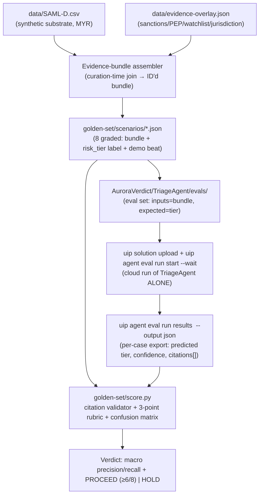

# Golden-Set Accuracy Validation

**Ticket:** TBD
**Type:** Technical — Validation

This is the de-risking experiment that runs before any of the triage orchestration is
built. It proves, on a realistic set of curated cases with known correct answers, that the
triage agent's reasoning is genuinely accurate and audit-defensible — not merely
plausible-sounding. The result gates whether the team commits to building the full process
or stops to fix the agent's reasoning and evidence design first.

## Motivation

The whole value of this initiative rests on one assumption: that the agent's cited
escalate-or-close recommendations are correct and would survive an audit. If that
assumption is wrong, every downstream piece of work — the orchestration, the human-review
steps, the audit record — is built on sand. Building all of that first and only then
discovering the reasoning is unreliable would waste most of the available build window.

**Current state:** No evidence yet exists that the agent reasons correctly about AML risk.
The team has a design intent (a structured rationale with a risk tier, a confidence level,
and evidence citations that are checked against gathered evidence) but no measured proof
that the agent produces correct tier calls or that its citations actually point at real
evidence rather than invented details.

**Desired state:** A curated set of realistic AML scenarios, each with a known correct
answer, has been run through the triage agent's reasoning on its own. Each scenario is
scored against a clear rubric, and the agent's accuracy on risk-tier calls is reported as a
real, computed number. The team can state with evidence whether the agent's reasoning is
sound enough to build on, or name exactly what must be fixed first.

**Trigger:** This is the first build step in the rollout plan. The discovery work named the
agent's accuracy and audit-defensibility as the single riskiest assumption, and the plan
calls for testing it before the orchestration is built. Nothing downstream should start
until this validation has run.

## Scope

- **In scope:**
  - Selecting a public synthetic AML dataset (SAML-D or the IBM Transactions for AML
    dataset) as the realistic source material, and attributing its license.
  - Curating 8 to 12 golden-set scenarios drawn from that dataset, each engineered to
    exercise a specific decision route and demonstration moment — for example: a clean
    close, a red-flag override, a caught invented citation, a maker–checker disagreement,
    and an ambiguous escalation.
  - Building an engineered evidence layer that assembles each scenario's evidence picture
    and adds synthetic sanctions and politically-exposed-person (PEP) indicators, because
    the raw dataset contains none.
  - Recording, for each scenario, the known correct risk tier (the answer the agent is
    being measured against).
  - Running each scenario through the triage agent's reasoning on its own, before any
    orchestration exists.
  - Scoring each scenario on the three-point rubric: correct risk-tier call; relevant
    evidence cited with every citation confirmed against the gathered evidence; and whether
    the result would survive an audit.
  - Computing and reporting the precision and recall of the agent's tier calls against the
    known answers, as real numbers.
  - Writing up the outcome as a clear pass-or-fix verdict that gates the rest of the work.

- **Out of scope:**
  - Building the orchestration, the human-review steps, or the audit store (later stories).
  - Any use of real or anonymized-real customer data.
  - Wiring genuine external evidence sources; the evidence layer is engineered for this
    validation only.
  - Setting a hard numeric pass threshold on precision and recall — reporting them as real
    numbers is the bar, not clearing a specific value.

## Goals

- Curate a golden set of 8 to 12 scenarios, each tied to a specific decision route and
  demonstration moment, each with a recorded known-correct risk tier.
- Score every scenario on the three-point rubric and have at least 6 of 8 scenarios pass
  all three points.
- Report the agent's precision and recall on its risk-tier calls as real, computed numbers
  measured against the known answers.
- Produce a clear go-or-fix verdict: either the reasoning is sound enough to build on, or a
  named list of reasoning and evidence-design problems to fix before building.

## Non-Goals

- Tuning the agent to hit any specific precision or recall figure. The figures are reported
  honestly; they are not a target to be gamed.
- Validating the human-review, batch sign-off, or challenger behaviour — those belong to
  later stories and are not exercised here.
- Proving the orchestration's end-to-end timing, routing, or audit-record completeness.

## Success Criteria

- At least 6 of the 8 golden-set scenarios pass all three rubric points (correct tier call;
  relevant, fully-validated citations; would survive an audit).
- The agent's precision and recall on risk-tier calls are reported as real numbers against
  the dataset's known answers. There is no hard pass threshold on these figures — reporting
  them is the requirement.
- The dataset is named and its license is attributed.
- Every invented or untraceable citation produced by the agent during the run is detected
  and recorded as a rubric failure for that scenario — none passes unnoticed.
- The run concludes with an explicit verdict: proceed to build, or fix named reasoning and
  evidence-design problems first.

## Acceptance Criteria

> Operational scenarios describing the observable behaviour of the validation run, from the
> point of view of someone watching the results.

### Scenario: A clean low-risk case is called correctly with grounded citations

```gherkin
Given a golden-set scenario for customer Mariam Hassan whose known correct answer is "low risk — close"
  And her evidence picture shows a RM3,500 salary deposit, no sanctions match, no PEP match, and no structuring pattern
When the scenario is run through the triage agent's reasoning on its own
Then the agent calls the risk tier "low"
  And the agent cites only evidence items present in the gathered evidence picture
  And every cited item is confirmed to trace back to a real gathered item
  And the scenario is scored as passing all three rubric points
```

### Scenario: A structuring pattern is escalated correctly

```gherkin
Given a golden-set scenario for customer Daniel Okoro whose known correct answer is "high risk — escalate"
  And his evidence picture shows three cash deposits of RM24,800, RM24,200, and RM24,500 within five days
When the scenario is run through the triage agent's reasoning on its own
Then the agent calls the risk tier "high"
  And the agent cites the three near-threshold deposits as the basis for the call
  And every cited item is confirmed to trace back to a real gathered item
  And the scenario is scored as passing all three rubric points
```

### Scenario: An invented citation is caught and recorded as a failure

```gherkin
Given a golden-set scenario engineered to tempt the agent into citing evidence that was never gathered
  And the gathered evidence picture contains no adverse-media report about the customer
When the scenario is run through the triage agent's reasoning on its own
  And the agent cites "an adverse-media report linking the customer to fraud" that does not exist in the gathered evidence
Then the citation is flagged as untraceable to any gathered evidence item
  And the scenario is scored as failing the citation rubric point
  And the invented citation is recorded in the run results rather than passing unnoticed
```

### Scenario: An ambiguous, low-confidence case is handled conservatively

```gherkin
Given a golden-set scenario for customer Priya Nair whose known correct answer is "medium risk — send to a human"
  And her evidence picture is deliberately mixed: a RM15,000 transfer to a new counterparty with thin customer history and no clear red flag
When the scenario is run through the triage agent's reasoning on its own
Then the agent does not call the case "low risk" with high confidence
  And the agent reports a confidence level below the threshold that would allow an automatic low-risk disposition
  And the scenario is scored against the known "medium risk" answer
```

### Scenario: Precision and recall are computed and reported as real numbers

```gherkin
Given all 8 golden-set scenarios have been run through the agent's reasoning
  And each scenario has a recorded known-correct risk tier
When the run is complete
Then the agent's precision on its risk-tier calls is computed against the known answers and reported as a real number
  And the agent's recall on its risk-tier calls is computed against the known answers and reported as a real number
  And these figures are reported regardless of whether they clear any particular value
```

### Scenario: At least six of eight scenarios pass and the build is cleared to proceed

```gherkin
Given all 8 golden-set scenarios have been scored on the three-point rubric
When 6 or more scenarios pass all three rubric points
Then the validation verdict is "proceed to build the orchestration"
  And the passing and failing scenarios are listed with their scores
```

### Scenario: The agent fails to clear the bar and the build is held

```gherkin
Given all 8 golden-set scenarios have been scored on the three-point rubric
When only 4 scenarios pass all three rubric points
Then the validation verdict is "do not build yet — fix the agent's reasoning and evidence design first"
  And the specific reasons each failing scenario fell short are recorded
  And the named problems are the input to revising the agent before this validation is re-run
```

### Scenario: The dataset and its license are attributed in the results

```gherkin
Given the golden-set scenarios are drawn from a public synthetic AML dataset
When the validation results are written up
Then the dataset is named
  And its license is attributed
  And no real or anonymized-real customer data appears anywhere in the scenarios
```

## Constraints

- **Data:** Only a public synthetic AML dataset may be used as the source material — SAML-D
  or the IBM Transactions for AML dataset. No real or anonymized-real customer data is
  permitted anywhere in the scenarios or the engineered evidence layer.
- **License attribution:** The chosen dataset's license must be attributed in the results.
  The IBM Transactions for AML dataset is licensed CDLA-Sharing-1.0; SAML-D's license is
  stated on its Kaggle license tab and must be confirmed and attributed before use.
- **Gating:** This validation gates the agent's design. A failure to clear the bar means the
  agent's reasoning and evidence design are fixed before any orchestration work begins, and
  the validation is re-run.
- **Reporting honesty:** Precision and recall are reported as the real computed numbers.
  There is no hard pass threshold on these figures and they must not be presented as if a
  target had been met.
- **Rollback:** N/A — this is a one-off measurement that produces a verdict, not a change to
  a running system.

## Dependencies

- Access to a public synthetic AML dataset (SAML-D or the IBM Transactions for AML dataset)
  and confirmation of its license.
- The triage agent's reasoning design (its instructions and the rubric it writes to) being
  defined well enough to run on its own, ahead of any orchestration.
- The engineered evidence layer that assembles each scenario's evidence picture and injects
  the synthetic sanctions and PEP indicators the raw data lacks.

## Open Questions

> Resolve all questions before implementation. Non-blocking questions may be deferred with
> rationale.

- [x] ~~What accuracy bar must the agent clear?~~ — **Resolved:** at least 6 of 8 golden-set
  scenarios pass all three rubric points; precision and recall are reported as real numbers
  with no hard pass threshold.
- [x] ~~May real or anonymized-real data be used?~~ — **Resolved:** no. A public synthetic
  dataset only, with its license attributed, plus an engineered evidence layer.
- [x] ~~What does the scoring rubric measure?~~ — **Resolved:** three points per scenario —
  correct risk-tier call; relevant evidence cited with every citation validated against the
  gathered evidence; and whether the result would survive an audit.
- [ ] Which of the two candidate datasets (SAML-D or IBM Transactions for AML) is the better
  fit for engineering the chosen demonstration moments — **Deferred (non-blocking):** either
  satisfies the synthetic-data and license-attribution constraints; the choice can be made
  during curation without blocking the start of the work.

---

## Functional Requirements

> Technical contract for the offline de-risking harness. All shared entities, the agent I/O
> contract, the gate rules, and the error catalogue are defined once in
> [the overview's "# Technical Architecture (Shared)"](spec.md#technical-architecture-shared)
> and are referenced — never redefined — here.

**FR-1 — Deterministic, repeatable run.** The harness runs the `AuroraVerdict/TriageAgent`
over a fixed scenario set and produces a verdict that is reproducible from the same inputs.
The agent itself is non-deterministic (LLM), so determinism is enforced at the *scoring*
layer, not the generation layer: (a) the scenario set, labels, evidence overlay, and the
Exact-match evaluator config are version-controlled; (b) `golden-set/score.py` is pure
(stdlib only, no network, no clock-dependent or random behaviour) and yields identical
precision/recall/verdict for identical eval-export input; (c) each `uip agent eval run start`
records its `run_id`, model name, and timestamp so a run is traceable. Re-scoring an archived
export must reproduce the prior numbers byte-for-byte.

**FR-2 — The 3-point rubric as a checkable function.** `score.py` exposes
`score_scenario(case) -> {tier_ok, citations_ok, audit_ok, passed}` where `passed = tier_ok
AND citations_ok AND audit_ok`:
- `tier_ok` — the agent's `risk_tier` equals the scenario's labeled `risk_tier` (the
  Exact-match evaluator's boolean for that case).
- `citations_ok` — **every** `evidence_id` in the agent's `citations[]` exists in the
  assembled bundle for that scenario. This reuses the SAME deterministic validator logic as
  the production gate (`DecisionGateApi`, see overview "Evidence-bundle + ID-only citation
  contract"): present → counts as verified; any absent id → `CITATION_UNVERIFIED` and
  `citations_ok = false`. A scenario with zero citations on a call that requires evidence
  also fails this point.
- `audit_ok` — the record is audit-survivable: a non-empty `rationale`, a `confidence` in
  `[0,100]`, AND `citations_ok` (an unverifiable citation can never be audit-survivable). The
  agent NEVER self-grades this — `score.py` computes it deterministically.

**FR-3 — Precision/recall computed from exported per-case results.** After
`uip agent eval run start --wait`, per-case results are exported via
`uip agent eval run results <run_id> --output json`. `score.py` builds a 3-class confusion
matrix (`low`/`medium`/`high`) of labeled vs. predicted tier, then reports **macro-averaged**
precision and recall plus the per-class breakdown. NO built-in evaluator computes these (per
[ADR 003](../../adr/003-custom-precision-recall-scoring.md)); they are computed in the script
from the export. Figures are printed as real numbers with no hard pass threshold and must not
be framed as hitting a target.

**FR-4 — The go/fix verdict and the ≥6/8 bar.** `score.py` emits exactly one verdict:
- `PROCEED` when `passed_count >= 6` of the 8 graded scenarios (the success bar), printing
  the pass/fail list with each scenario's rubric breakdown.
- `HOLD — FIX FIRST` when `passed_count < 6`, printing, per failing scenario, which rubric
  point(s) failed and a one-line reason, as the named input to revising the agent before the
  validation is re-run. The bar is `>= 6`; exactly 6 PROCEEDs.

**FR-5 — Validation rules for the scenario label set.** Before scoring, `score.py` validates
the label set and aborts with a non-zero exit on any violation (these are authoring errors,
not agent failures):
- Each scenario has exactly one `risk_tier` label ∈ `{low, medium, high}`.
- Scenario IDs are unique and each maps to exactly one demo beat.
- Every scenario referenced by the eval set has a corresponding `golden-set/scenarios/*.json`
  file, and vice versa (no orphan labels, no unlabeled cases).
- The graded set is exactly 8 scenarios (the bar is stated as "6 of 8"); the curated pool may
  hold up to 12, but the scored set is pinned to 8 so the denominator is fixed.
- At least one scenario each of `low`, `medium`, and `high` exists, plus the invented-citation
  case, so precision/recall is defined for every class.

## System Design

The offline harness is a five-stage pipeline. The first three stages prepare and run; the
last two score. Nothing here orchestrates — the agent runs ALONE, before any BPMN spine
exists.

1. **Dataset + overlay** (`data/SAML-D.csv` + `data/evidence-overlay.json`) — the synthetic
   substrate plus the engineered sanctions/PEP/watchlist/jurisdiction injection. Amounts
   normalized to MYR.
2. **Evidence-bundle assembler** — a curation-time step (run as part of authoring the
   scenarios) that joins a chosen SAML-D row with its overlay entries into an ID'd bundle of
   the shape the agent expects (`evidence_bundle: [{evidence_id, category, summary,
   payload}]`, per overview "Triage agent I/O"). For this offline story the assembler output
   is materialized into each `golden-set/scenarios/*.json` so the run needs no live
   `EvidenceGatherApi`.
3. **TriageAgent eval set** (`AuroraVerdict/TriageAgent/evals/`) — one eval case per
   scenario: `--inputs` is the assembled bundle, `--expected` is the labeled `risk_tier`
   (and `recommendation`). Run cloud-side after `uip solution upload`.
4. **Deterministic citation check + rubric** — `score.py` applies the shared citation
   validator (every cited `evidence_id` must exist in the bundle) and the 3-point rubric to
   each exported case.
5. **`score.py` precision/recall + verdict** — confusion matrix → macro P/R → the ≥6/8
   go/fix verdict.



**Tradeoffs (see [ADR 003](../../adr/003-custom-precision-recall-scoring.md)):**
- *Why script-computed P/R, not evaluator-native:* the low-code runtime's four evaluators
  (Exact match, JSON similarity, Semantic Similarity, Trajectory) compute booleans/scores per
  case — none computes precision/recall, and the classification/confusion-matrix evaluators
  exist only for coded agents. So the deterministic Exact-match evaluator gives per-case
  pass/fail and a ~40-line stdlib script turns the export into P/R. The script also lets the
  rubric reuse the production citation validator, so the validation measures what ships.
- *Why not pivot to a coded agent:* that would buy evaluator-native metrics but contradicts
  [ADR 001](../../adr/001-low-code-agent-builder-for-triage-and-challenger.md) and adds build
  risk for a reporting concern a small script solves. Rejected.

## Permissions & Security

N/A — offline validation on synthetic data, no runtime or public surface. The TriageAgent
exposes no endpoint here; there are no Action Center tasks, no Data Fabric writes, and no
external connectors in this story.

One exception: agent eval execution is **cloud-based**. It requires an authenticated UiPath
tenant (the `uip` CLI is already authenticated per the overview) and a prior
`uip solution upload ./AuroraVerdict` so the agent exists cloud-side to run against. No new
roles, secrets, or public routes are introduced.

## Threat Model Checklist

Refers to the overview "Cross-cutting Threat Model"; only what is specific to this offline
story is noted.

- **Data classification:** Synthetic only — `data/SAML-D.csv` is a public synthetic dataset
  (`berkanoztas/synthetic-transaction-monitoring-dataset-aml`) and the overlay names
  (sanctions/PEP/watchlist) are fictional. No PII, no real or anonymized-real data. The
  dataset license (confirmed on its Kaggle license tab; IBM CDLA-Sharing-1.0 is the alt) is
  attributed in the written-up results — `audit_ok` reporting is not blocked by it, but the
  license line is a release gate for the write-up.
- **Attack surface:** N/A — offline run, no public route, no human-input forms, no live
  evidence source in this story. The agent prompt does ingest synthetic evidence text, but
  the deterministic citation check in `score.py` is the backstop: the LLM cannot make
  `score.py` accept an `evidence_id` that is not in the bundle.
- **Authn/authz:** UiPath Automation Cloud identity for the cloud eval run only (one
  tenant/folder). No authz changes; `score.py` runs locally with no credentials.
- **Dependency additions:** the public dataset (license attributed — the only new
  third-party data dependency) and Python 3 **stdlib only** for `score.py` (no pip packages,
  so no new supply-chain surface). No new UiPath connectors are added by this story.

## Architecture Notes

- **Dataset swap isolated by the overlay.** SAML-D vs. IBM Transactions for AML is a
  drop-in choice: only the `data/SAML-D.csv` read and the curation-time assembler change. The
  assembled `golden-set/scenarios/*.json` bundle shape (and therefore the eval set, the agent,
  and `score.py`) is dataset-agnostic, so the open question on dataset choice never blocks
  downstream work.
- **Agent runs ALONE before orchestration.** This story deliberately exercises only
  `TriageAgent/agent.json` via `uip agent eval` — no BPMN spine, no `DecisionGateApi`, no
  HITL, no Data Fabric writes. It gates the build: a `HOLD` verdict stops orchestration work
  until the agent's reasoning/evidence design is fixed and the validation is re-run.
- **Eval tooling.** Per-scenario pass/fail comes from the deterministic **Exact match**
  evaluator on `risk_tier`; Semantic Similarity / Trajectory are NOT used for the bar (they
  are LLM-judged 0–100 scores, not deterministic pass/fail). Runs are cloud-based and need
  `uip solution upload` first.
- **`score.py` kept in sync with the eval export format.** The script's only coupling to the
  platform is the JSON shape of `uip agent eval run results <run_id> --output json`. That
  shape is pinned by a small fixture in `golden-set/` and a parse guard in `score.py` that
  aborts with a clear message if a field it depends on (predicted `risk_tier`, `confidence`,
  `citations[]`, the per-case label) is missing — so an export-format drift fails loudly
  rather than silently miscomputing P/R.

## Implementation Plan

> Each sub-task lists full repo paths, a size estimate (S ≈ <2h, M ≈ half-day, L ≈ ~1 day),
> and an INDEPENDENT/SEQUENTIAL label relative to the others.

1. **Choose + license the dataset.** `data/SAML-D.csv`. Download SAML-D
   (`berkanoztas/synthetic-transaction-monitoring-dataset-aml`), confirm the license on its
   Kaggle license tab, normalize amounts to MYR. Record the dataset name + license string for
   the write-up. **Size: S. INDEPENDENT.**
2. **Build the engineered evidence overlay.** `data/evidence-overlay.json`. Author synthetic
   sanctions / PEP / watchlist / jurisdiction entries keyed to the SAML-D rows the scenarios
   will use (the raw data has none). Fictional names only. **Size: M. SEQUENTIAL after (1).**
3. **Curate the golden-set scenarios.** `golden-set/scenarios/` — ≥8 graded files (pool up to
   12), each an assembled ID'd bundle + a labeled `risk_tier` + a mapped demo beat. Cover at
   minimum: clean low-risk close (Mariam Hassan), structuring → high escalate (Daniel Okoro),
   invented-citation catch, ambiguous medium → human (Priya Nair), plus a sanctions/PEP
   red-flag case and one more high-value/jurisdiction case to fill the 8. **Size: L.
   SEQUENTIAL after (2).**
4. **Author / iterate the triage agent.** `AuroraVerdict/TriageAgent/agent.json`. System
   prompt sets the output contract (cite ONLY `evidence_id`s present in the supplied bundle;
   produce `{risk_tier, confidence, recommendation, rationale, citations[]}`) and the
   `outputSchema` enforces that structured shape (per overview "Triage agent I/O"). Enable the
   `prompt_injection` / `user_prompt_attacks` guardrails. **Size: M. SEQUENTIAL after (3)**
   (needs scenarios to debug against).
5. **Build the eval set + Exact-match evaluator.** `AuroraVerdict/TriageAgent/evals/`. Create
   the set, add one case per graded scenario (`--inputs` = bundle, `--expected` = labeled
   `risk_tier`/`recommendation`), add an Exact-match evaluator on `risk_tier`. **Size: M.
   SEQUENTIAL after (3) and (4).**
6. **Write the scorer.** `golden-set/score.py` (Python 3 stdlib only). Parse the eval export,
   run the label-set validation (FR-5), apply the citation validator + 3-point rubric (FR-2),
   build the confusion matrix, compute macro precision/recall (FR-3), emit the ≥6/8 go/fix
   verdict (FR-4). Include the export-format parse guard + a small fixture. **Size: M.
   SEQUENTIAL after (5)** (needs the real export shape) — drafting against the fixture can
   start in parallel with (4)/(5).
7. **Run + write up the verdict.** `uip solution upload`, `uip agent eval run start --wait`,
   export results, `python golden-set/score.py`. Write up: P/R numbers, the per-scenario
   rubric table, the PROCEED/HOLD verdict, and the dataset name + license attribution.
   **Size: S. SEQUENTIAL after (6).**

## Negative Constraints

- Do **not** tune the agent, scenarios, or labels to hit a precision/recall target — the
  figures are reported honestly; there is no hard threshold and they must not be framed as a
  met target.
- Do **not** use real or anonymized-real customer data anywhere — synthetic dataset + the
  engineered overlay only; overlay names are fictional.
- Do **not** build any orchestration here — no BPMN, no `DecisionGateApi`, no HITL, no Data
  Fabric writes. This story runs the agent ALONE.
- Do **not** let the agent self-grade its own citations or audit-survivability — the
  deterministic validator in `score.py` (the same logic as the production gate) decides
  `citations_ok`, and `audit_ok` is computed, never claimed by the LLM.
- Do **not** use Semantic Similarity or Trajectory as the pass/fail bar — only the
  deterministic Exact-match evaluator on `risk_tier` gates a scenario.
- Do **not** add pip dependencies to `score.py` — stdlib only.
- Do **not** silently swallow export-format drift — the parse guard must abort loudly rather
  than miscompute.
- Do **not** redefine shared entities, the agent I/O contract, or the gate rules here — they
  are frozen in the overview.

## Test Scenarios

Implementation-level checks. Scenario IDs below are the `golden-set/scenarios/*.json` graded
set; each maps to a demo beat.

| Scenario ID | Customer | Labeled `risk_tier` | Demo beat | Expected agent behaviour |
| ----------- | -------- | ------------------- | --------- | ------------------------ |
| `GS-01-mariam-clean-low` | Mariam Hassan | `low` | clean close | `risk_tier=low`, cites the RM3,500 salary-deposit evidence id; all citations resolve → all 3 rubric points pass |
| `GS-02-okoro-structuring-high` | Daniel Okoro | `high` | structuring / high | `risk_tier=high`, cites the three near-threshold deposits (RM24,800 / RM24,200 / RM24,500 in 5 days); all citations resolve → all 3 pass |
| `GS-03-invented-citation` | (engineered) | `low` | invented-citation catch | agent cites a non-existent "adverse-media report linking the customer to fraud" → `CITATION_UNVERIFIED`, `citations_ok=false`, `audit_ok=false` → scenario FAILS the rubric (the catch is the point) |
| `GS-04-priya-ambiguous-medium` | Priya Nair | `medium` | ambiguous medium | RM15,000 transfer to a new counterparty, thin history, no clear red flag → agent does not call `low` with `confidence ≥ 85`; scored against `medium` |
| `GS-05-sanctions-pep-high` | (engineered) | `high` | sanctions/PEP red flag | counterparty sanctions + PEP overlay hit → `risk_tier=high`, cites the screening evidence ids; all resolve → all 3 pass |
| `GS-06`..`GS-08` | (curated) | mix of `low`/`medium`/`high` | high-value, jurisdiction, second clean | fill the graded 8 so every class has ≥1 labeled case |

**Exact-match evaluator config (`AuroraVerdict/TriageAgent/evals/`):**
- Type: Exact match (deterministic boolean).
- Target field: the agent output's `risk_tier`.
- Expected: the scenario's labeled `risk_tier` (set per eval case via
  `uip agent eval add <case> --set "GoldenSet" --inputs '{...bundle...}' --expected
  '{"risk_tier":"high"}'`).
- Pass = boolean true (predicted tier == labeled tier). This boolean is `tier_ok` in the
  rubric.

**Worked precision/recall example (illustrative 8-case confusion matrix).** Rows = labeled,
columns = predicted:

|              | pred low | pred medium | pred high |
| ------------ | -------- | ----------- | --------- |
| **low** (3)  | 3        | 0           | 0         |
| **medium** (2) | 1      | 1           | 0         |
| **high** (3) | 0        | 0           | 3         |

Per-class precision = TP / (TP + FP), recall = TP / (TP + FN):
- `low`: precision = 3/(3+1) = 0.75; recall = 3/(3+0) = 1.00
- `medium`: precision = 1/(1+0) = 1.00; recall = 1/(1+1) = 0.50
- `high`: precision = 3/(3+0) = 1.00; recall = 3/(3+0) = 1.00
- **Macro precision** = (0.75 + 1.00 + 1.00)/3 = **0.917**; **macro recall** =
  (1.00 + 0.50 + 1.00)/3 = **0.833**. (Numbers illustrate the computation only — not a
  target.)

**Invented-citation case (`GS-03`) end to end.** The agent's `citations[]` contains an id
absent from the assembled bundle → the shared citation validator marks it
`CITATION_UNVERIFIED` → `citations_ok = false` → `audit_ok = false` → `passed = false`. The
failure (with the offending id) is recorded in the run results, never passing unnoticed —
this is the success criterion that the catch works, not an agent-quality regression.

## Verification

> UiPath project — there is NO web E2E framework. Verification is `uip agent debug` /
> `uip agent eval` plus the `score.py` run. No Playwright/Cypress.

1. **Single-case smoke (`uip agent debug`).** Run one scenario (e.g. `GS-02-okoro-structuring
   -high`) through the agent locally to confirm the `outputSchema` shape and that it cites
   bundle ids:
   `uip agent debug --input '{...GS-02 bundle...}'` → expect a structured
   `{risk_tier:"high", confidence, recommendation, rationale, citations:[...]}` with citation
   ids that appear in the input bundle.
2. **Upload + cloud eval run.** `uip solution upload ./AuroraVerdict`, then
   `uip agent eval run start --set "GoldenSet" --wait --output json` — capture the `run_id`,
   model name, and timestamp (FR-1 traceability).
3. **Export per-case results.** `uip agent eval run results <run_id> --output json` for the
   full export; `uip agent eval run results <run_id> --only-failed --verbose` to inspect any
   Exact-match failures (including the deliberately-failing `GS-03`).
4. **Score + verdict.** `python golden-set/score.py` over the export → prints the confusion
   matrix, macro precision/recall as real numbers (FR-3), the per-scenario 3-point rubric
   table, and the `PROCEED` (≥6/8 passed, FR-4) or `HOLD — FIX FIRST` verdict with named
   failing-point reasons. `GS-03` must show `citations_ok=false` / `CITATION_UNVERIFIED`.
5. **License attribution assertion.** Confirm the written-up results name the dataset
   (`berkanoztas/synthetic-transaction-monitoring-dataset-aml`, SAML-D) and attribute its
   license (confirmed on its Kaggle license tab; IBM Transactions for AML is CDLA-Sharing-1.0
   if swapped) — and that no real or anonymized-real data appears anywhere.
