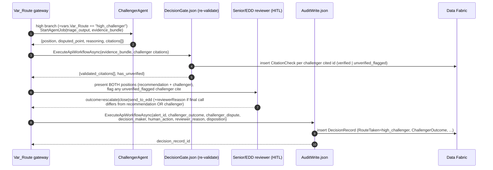

# Maker–Checker Challenger on the High-Risk Path

**Ticket:** TBD

On the high-risk route, before a senior reviewer signs off, an independent challenger reviews the original recommendation and either agrees with it or raises a documented disagreement that names exactly what it disputes and why, citing only evidence already gathered in the case. The senior / enhanced-due-diligence (EDD) reviewer sees both the original recommendation and the challenger's position side by side before making the final call, and the challenger's outcome becomes part of the permanent decision record. This gives the most consequential decisions a genuine second set of eyes without slowing them down with a full re-investigation.

## User Story

As a senior / enhanced-due-diligence (EDD) reviewer making the final call on a high-risk alert, I want an independent challenger to agree with or dispute the original recommendation — and to show me exactly what it disputes and why — so that I can sign off knowing the call has survived a second opinion, or knowingly decide against that opinion and have my reasoning recorded.

## Background & Context

**Current state:**

- High-risk alerts already reach a senior / EDD reviewer with an agent-produced recommendation: the proposed call (escalate, close, or send onward), the high-risk tier, the agent's confidence, and a list of cited evidence with each citation already checked against the gathered case file.
- The senior reviewer reads that single recommendation and signs it or overrides it. There is one line of reasoning in front of them and no structured second opinion.

**Problem:**

- A single recommendation, however well cited, is still one chain of reasoning. On the highest-consequence alerts — the ones most likely to be questioned by a regulator or internal auditor — there is no recorded evidence that anyone independently tested that chain before the final call.
- When a high-risk decision is reviewed months later, "a senior reviewer agreed with the recommendation" is weaker than "an independent challenger reviewed the recommendation, took a position, and the senior reviewer decided in full view of it." The defensibility gap is exactly on the cases that matter most.
- Without a structured challenge, a confident-sounding but flawed recommendation can pass to sign-off unexamined, and a reviewer who happens to disagree has nothing on the record showing the disagreement was considered.

## Target User & Persona

- **Who:** A senior investigator / enhanced-due-diligence (EDD) reviewer who owns the final disposition of high-risk AML alerts and personally answers for them on audit.
- **Context:** They are working a high-risk alert that has already been routed to the high-risk path and already carries an agent recommendation. They are at the sign-off step, deciding whether to escalate, close, or send the case onward.
- **Current workaround:** They mentally play devil's advocate against the single recommendation in front of them, or informally ask a colleague — neither of which leaves anything on the record.

## Goals

- Give every high-risk alert an independent agree/disagree review of its recommendation before senior sign-off.
- When the challenger disagrees, make the specific point of dispute and the reasoning behind it visible to the senior reviewer, grounded only in evidence already in the case.
- Let the senior reviewer make the final call in full view of both positions — including deciding against the challenger — and capture that choice and its reasoning in the record.
- Make the challenger's outcome a permanent, audit-visible part of every high-risk decision record.

## Non-Goals

- **Not a full re-investigation.** The challenger does not gather new evidence, run new screening, or build a parallel case. It reviews the existing recommendation against the existing case file only.
- **Does not decide anything.** The challenger only takes a position; the senior / EDD reviewer always makes the final call.
- **Does not apply to medium- or low-risk alerts.** The challenger runs only on the high-risk path. How alerts reach the high-risk path, the original recommendation itself, and low-risk handling are covered by other stories.
- **Does not loop or re-run.** A single challenger position is produced for the senior reviewer; there is no back-and-forth negotiation between the challenger and the original recommendation.

## User Workflow

> Step-by-step from the senior / EDD reviewer's perspective.

1. **A high-risk alert reaches final review.** The senior reviewer opens a high-risk case that already carries the original recommendation — the proposed call, the high-risk tier, the confidence, and the cited evidence.
2. **An independent challenger has already weighed in.** Before the reviewer is asked to decide, the challenger has reviewed the recommendation and recorded a position: either it agrees, or it disagrees and states exactly what it disputes and why.
3. **The reviewer sees both positions.** The case shows the original recommendation and, alongside it, the challenger's position — a clear concurrence, or the specific disagreement with its reasoning and the evidence it relies on.
4. **The reviewer decides.** The reviewer makes the final call. When the challenger agreed, they can confirm and sign off. When the challenger disagreed, they weigh the dispute and either side with the challenger or decide against it, recording why.
5. **The decision is recorded.** The final disposition is logged together with the challenger's outcome (agreed or the specific disagreement) and the reviewer's decision and reasoning, so a later reader can reconstruct that the call was independently challenged before it was made.

## Acceptance Criteria

> Written from the senior / EDD reviewer's perspective. All examples use a high-risk alert. Realistic dataset values are used; no system identifiers appear.

### Scenario: Challenger agrees and the reviewer signs off

```gherkin
Given the alert for "Northwind Logistics" is on the high-risk path
  And the original recommendation is to escalate the alert, citing a RM2,000,000 transfer chain layered through three intermediary accounts and a sanctions-list match on a counterparty
  And the challenger has independently reviewed the recommendation and agreed with it
When David, the senior reviewer, opens the case on 18 March 2026
Then he sees the original recommendation to escalate alongside the challenger's position of agreement
  And he can confirm the escalation and sign off
  And the record shows the challenger agreed and that David made the final call to escalate on 18 March 2026
```

### Scenario: Challenger disagrees with a documented reason and the reviewer sides with it

```gherkin
Given the alert for "Northwind Logistics" is on the high-risk path
  And the original recommendation is to close the alert as the layered transfers appear to be normal trade settlement
  And the challenger has independently reviewed the recommendation and disagreed, disputing the close because the RM2,000,000 was moved through three intermediary accounts within four days in a pattern the cited evidence does not explain
When David, the senior reviewer, opens the case on 18 March 2026
Then he sees the original recommendation to close alongside the challenger's documented disagreement and the evidence it relies on
  And he decides to escalate the alert instead of closing it, recording that he agrees with the challenger's concern about the unexplained layering
  And the record shows the challenger disagreed, the specific point disputed, and that David escalated against the original recommendation on 18 March 2026
```

### Scenario: Reviewer overrides the challenger and records why

```gherkin
Given the alert for "Cedar Grove Imports" is on the high-risk path
  And the original recommendation is to escalate the alert because of a politically-exposed-person match on the account holder
  And the challenger has independently reviewed the recommendation and disagreed, disputing the escalation because the cited politically-exposed-person match refers to a different individual with the same name
When Priya, the senior reviewer, opens the case on 22 March 2026
Then she sees the original recommendation to escalate alongside the challenger's documented disagreement
  And she decides to escalate anyway, recording that she is escalating conservatively because the name match cannot be ruled out from the evidence in the case
  And the record shows the challenger disagreed, that Priya overrode the challenger's position, her reason, and that the final call was to escalate on 22 March 2026
```

### Scenario: Challenger's position cites only evidence already in the case

```gherkin
Given the alert for "Harbor Point Trading" is on the high-risk path
  And the case file contains a customer profile, a 90-day transaction history, sanctions and politically-exposed-person screening results, and adverse-media findings
  And the original recommendation is to escalate the alert
When the challenger records its position before the senior reviewer opens the case
Then every point the challenger raises refers only to evidence already gathered in the case file
  And any reference that cannot be traced to a real gathered evidence item is flagged for the reviewer before they decide
  And the reviewer never sees a challenger reason backed by evidence that is not in the case
```

### Scenario Outline: The challenger outcome and the final call appear in the record

```gherkin
Given the alert for "<customer>" is on the high-risk path
  And the original recommendation is to <recommendation>
  And the challenger has independently reviewed it with a position of "<challenger position>"
When <reviewer> makes the final call of "<final call>" on <date>
Then the record shows the original recommendation, the challenger's position, the reviewer's name, the final call, and the reviewer's reason
  And a later reader can reconstruct that the recommendation was independently challenged before the decision was made

Examples:
  | customer            | recommendation | challenger position                                   | reviewer | final call | date          |
  | Northwind Logistics | escalate       | agreed                                                | David    | escalate   | 18 March 2026 |
  | Cedar Grove Imports | escalate       | disagreed: cited politically-exposed-person mismatch  | Priya    | escalate   | 22 March 2026 |
  | Harbor Point Trading| close          | disagreed: unexplained RM2,000,000 layering pattern      | David    | escalate   | 25 March 2026 |
```

### Scenario: Challenger runs only on the high-risk path

```gherkin
Given an alert has been assigned the medium-risk tier and is not on the high-risk path
When the original recommendation is produced for that alert
Then no challenger review is performed for it
  And the case is presented for the standard single sign-off without a challenger position
```

## Business Rules & Constraints

- **The challenger runs only on the high-risk path.** Medium- and low-risk alerts never receive a challenger review.
- **The challenger is independent of the original recommendation.** It forms its own view of whether the recommendation holds, rather than restating or summarizing it.
- **The challenger takes exactly one of two positions:** it agrees with the recommendation, or it disagrees. A disagreement must name the specific point disputed and the reason for disputing it.
- **The challenger is bound by the same citation rule as the original recommendation.** It may rely only on evidence actually gathered into the case file. Any reason it raises that cannot be traced to a real gathered evidence item is flagged for the reviewer before they decide — an untraceable basis never passes silently.
- **The challenger is a review, not a re-investigation.** It does not gather new evidence, request new screening, or build a parallel case; it works from the existing case file only.
- **The senior / EDD reviewer always makes the final call.** The challenger never disposes of an alert. The reviewer may agree with the original recommendation, side with the challenger, or decide against the challenger; whenever the reviewer's final call differs from the original recommendation or from the challenger's position, the reviewer records why.
- **The challenger outcome is part of the decision record.** Every high-risk decision record carries the challenger's position (agreed, or the specific disagreement and its reasoning) alongside the original recommendation and the reviewer's final decision, so the full challenge-then-decide trail can be reconstructed later.

## Success Metrics

- **Challenge coverage:** 100% of high-risk alerts reaching senior / EDD sign-off carry a recorded challenger position before the final call is made.
- **Defensibility on the high-risk path:** 100% of high-risk decision records show the challenger's position, the reviewer's final call, and — where they differ — the reviewer's recorded reason.
- **Grounded challenges:** zero challenger reasons backed by evidence not in the case file reach the senior reviewer unflagged.
- **Caught disagreements demonstrated:** at least one golden-set high-risk scenario shows the challenger raising a documented disagreement that the senior reviewer acts on (qualitative, demonstrated).

## Dependencies

- **Core triage slice** — the original recommendation, its cited and checked evidence, the senior sign-off step, and the audit decision record that the challenger outcome is added to.
- **Red-flag override & conservative tiering** — the high-risk route the challenger runs on must already exist; this story does not decide which alerts become high risk.
- **The shared grounded-citation standard** — the challenger relies on the same rule that limits citations to evidence actually gathered into the case file.

## Open Questions

- [x] ~~What is the minimum-viable challenger?~~ — **Resolved:** an independent agree/disagree-with-reasons review of the original recommendation on the high-risk path before senior / EDD sign-off — not a full re-investigation, with the outcome recorded in the decision record.
- [x] ~~May the challenger introduce its own evidence?~~ — **Resolved:** no; the challenger is bound by the shared grounded-citation rule and works only from evidence already gathered into the case file.
- [x] ~~Who makes the final call when the challenger and the original recommendation disagree?~~ — **Resolved:** the senior / EDD reviewer always decides, in full view of both positions, and records a reason whenever their final call differs from the recommendation or the challenger.

---

> **Technical sections (appended by `prd-refine`).** Everything above this line is the
> product-owner-approved business content and is unchanged. Everything below is the
> implementation contract for a developer or a `/build` subagent. This story adds the
> **independent challenger agent and the senior / EDD sign-off on the high-risk path** — it
> does **not** stand up the solution, the triage agent, the API Workflows, or the Data
> Fabric entities (the **Core triage slice** does that) and does **not** decide which alerts
> become high risk (the **Red-flag override** story builds the `=vars.Var_Route == "high_challenger"`
> gateway this story branches off). All shared entities, schemas, contracts, error codes,
> and conventions live in the epic overview's **# Technical Architecture (Shared)** section
> ([spec.md](spec.md)) and are referenced — never redefined — here.

## Functional Requirements

| # | Requirement | Detail | Maps to AC |
| - | ----------- | ------ | ---------- |
| FR-1 | Challenger runs only on the high-risk path | The `ChallengerAgent` `bpmn:serviceTask` is reachable **only** from the `=vars.Var_Route == "high_challenger"` outgoing `bpmn:sequenceFlow` off the route `bpmn:exclusiveGateway` (built by the red-flag story). On the `medium_signoff` and `low_batch` branches no challenger node exists, so no challenger job is started and no challenger position is produced. | Business Rules §1; "runs only on the high-risk path" scenario |
| FR-2 | Challenger is independent, not a restatement | `ChallengerAgent/agent.json` is a **separate** agent project with its own system prompt instructing it to form its own view of whether the recommendation holds (optionally a different `settings.model` per [ADR 001](../../adr/001-low-code-agent-builder-for-triage-and-challenger.md)). Its input is the triage agent's structured output **plus** the same `evidence_bundle`; its prompt forbids merely summarising or echoing the recommendation. | Business Rules §2 |
| FR-3 | Exactly one of agree / disagree, disagree names the point | The challenger `outputSchema` produces `{position: "agreed"｜"disagreed", disputed_point, reasoning, citations[]}`. When `position = "disagreed"`, `disputed_point` and `reasoning` are required and non-empty (prompt-enforced); when `position = "agreed"`, `disputed_point` may be empty. There is no third position and no abstention. | Business Rules §3; "agrees" / "disagrees" scenarios |
| FR-4 | Challenger citations bound by the shared grounded-citation rule | The challenger may populate `citations[]` only with `evidence_id`s present in the supplied bundle (system-prompt output contract), and is **backstopped** by the same deterministic validator as the triage agent — `DecisionGateApi/DecisionGate.json` re-validates the challenger's cited ids: present → `verified`; absent → `unverified_flagged` (`CITATION_UNVERIFIED`), one `CitationCheck` row per cited id, surfaced to the reviewer **before** they decide. The LLM is never trusted to self-police. | Business Rules §4; "cites only evidence already in the case" scenario |
| FR-5 | Review, not re-investigation | The challenger reads only the triage output + the existing `evidence_bundle`. The high-risk branch starts **no** `EvidenceGather` re-run, **no** new screening, and **no** second `TriageAgent` job — there is no node on the high branch that gathers or screens. | Business Rules §5; Non-Goals |
| FR-6 | The reviewer always decides and records a reason on divergence | The high-risk disposition exists only as the result of the senior/EDD `Actions.HITL` `userTask` completing. The QuickForm shows **both** positions; the reviewer chooses a final call via `outcomes[]`. The output text field `reviewerReason` is **required** whenever the final call differs from the original recommendation **or** from the challenger's position (`OVERRIDE_REASON_REQUIRED`); when the reviewer confirms a call that both the recommendation and the challenger already agreed on, no reason is required. | Business Rules §6; "sides with challenger" / "overrides challenger" scenarios |
| FR-7 | Challenger outcome persisted to the record | `AuditWriteApi/AuditWrite.json` (extended by this story) sets `DecisionRecord.ChallengerOutcome ∈ {agreed, disagreed}` and `ChallengerDispute` (the `disputed_point` + `reasoning`, null when agreed), plus the reviewer's `DecisionMakerName`, `HumanAction`, `OverrideReason` (= `reviewerReason`), `FinalDisposition`, and timestamps, with `RouteTaken = high_challenger`. | Business Rules §7; "outcome and final call appear in the record" scenario outline |

## Permissions & Security

- **Senior / EDD reviewer role for the high-risk HITL task.** The high-path `Actions.HITL`
  `userTask` is assigned (assignee binding on the `userTask`) to the named senior / EDD
  reviewer user/group (demo: David and Priya, in the single `AuroraVerdict` folder) —
  distinct from the medium-path investigator group, so the most consequential calls require
  a senior actor. The accountable name is read back from the completed task into
  `DecisionRecord.DecisionMakerName`; no anonymous or unassigned high-risk disposition is
  possible.
- **Challenger agent has read-only access to the existing bundle.** `ChallengerAgent`
  receives the triage output and the same `evidence_bundle` as inputs and has **no** tool,
  connector, or binding that can gather evidence, run screening, or write to Data Fabric. It
  cannot reach `EvidenceGatherApi`, the dataset, or any external source. Its only output is
  the structured `{position, disputed_point, reasoning, citations[]}`; it never inserts a
  record or sets a disposition.
- **The challenger cannot introduce evidence (validator backstop).** Even if prompt
  injection in synthetic evidence text coerces the challenger into citing a fabricated id,
  the deterministic `DecisionGate` re-validation marks it `unverified_flagged`
  (`CITATION_UNVERIFIED`) and the reviewer sees the warning before deciding — the
  challenger's output never silently becomes truth. Enable the `prompt_injection` and
  `user_prompt_attacks` built-in guardrails on `ChallengerAgent` too (confirm `Available`
  via `uip agent guardrails list`), as on `TriageAgent`.
- **Threat model:** see the overview **## Cross-cutting Threat Model**. This story adds one
  new agent prompt (challenger) and one new Action Center form (senior/EDD sign-off) as
  attack-surface instances; deltas are itemised in the Threat Model Checklist below.

## System Design

This story adds the high-risk branch off the route gateway built by the red-flag story. The
branch components:

| Step | BPMN node | Type | Calls |
| ---- | --------- | ---- | ----- |
| 0 | Route gateway (pre-existing) | `bpmn:exclusiveGateway` on `=vars.Var_Route` | high `bpmn:sequenceFlow` with `bpmn:conditionExpression` `=vars.Var_Route == "high_challenger"` (built by the red-flag story) |
| 1 | ChallengerAgent | `bpmn:serviceTask` | `Orchestrator.StartAgentJob` → `ChallengerAgent/agent.json` (input = triage output + `evidence_bundle`) |
| 2 | DecisionGate-revalidate | `bpmn:serviceTask` | `Orchestrator.ExecuteApiWorkflowAsync` → `DecisionGateApi/DecisionGate.json` (re-validate challenger citations only) |
| 3 | Senior/EDD sign-off | `bpmn:userTask` | `Actions.HITL` (QuickForm authored in the `.bpmn`, shows both positions) |
| 4 | AuditWrite | `bpmn:serviceTask` | `Orchestrator.ExecuteApiWorkflowAsync` → `AuditWriteApi/AuditWrite.json` (sets challenger + reviewer fields) |
| 5 | End | `bpmn:endEvent` | — |



**Tradeoffs.** The challenger is a **separate** `ChallengerAgent` agent project, not a
re-use of `TriageAgent` ([ADR 001](../../adr/001-low-code-agent-builder-for-triage-and-challenger.md)):
two distinct projects give the challenger genuinely independent instructions and, if needed,
a different `settings.model` to reduce correlated errors — the opposite of a shared
prompt/model. The **rejected alternative — "one agent definition reused in two roles"** — is
less to maintain but gives weak independence (a single shared system prompt/model is the
opposite of what a defensible maker–checker design needs), so it was rejected. Citation
validation is **not** re-implemented for the challenger: the same deterministic
`DecisionGateApi/DecisionGate.json` validator is reused, keeping one authoritative grounding
backstop for both agents.

## Threat Model Checklist

| Dimension | This story's delta |
| --------- | ------------------ |
| **Data classification** | N/A — see overview. Customers (Northwind Logistics, Cedar Grove Imports, Harbor Point Trading) and all evidence are synthetic; no PII, no real/anonymized-real data. |
| **Attack surface** | Adds one new agent prompt (`ChallengerAgent` — its `evidence_bundle` input is attacker-controlled synthetic text in principle) and one new Action Center form (senior/EDD `Actions.HITL` QuickForm, human input field `reviewerReason`). No new API Workflows, no new public routes (the existing `DecisionGate` is reused). |
| **Authn/authz** | Adds the senior/EDD reviewer assignee binding on the high-path `userTask` (a more privileged group than the medium investigator); the high-risk disposition cannot be set by an unassigned actor; `DecisionMakerName` is read from the completed task, not free-typed. |
| **Prompt injection / LLM tampering** | `prompt_injection` + `user_prompt_attacks` guardrails enabled on `ChallengerAgent` as on `TriageAgent`. **The challenger cannot introduce evidence:** its citations pass through the same `DecisionGate` validator, so an injected/hallucinated challenger cite → `unverified_flagged` (`CITATION_UNVERIFIED`), surfaced to the reviewer before they decide. **The challenger cannot dispose:** it has no write path and no disposition outcome — the reviewer's `userTask` is the only thing that sets `FinalDisposition`. |
| **Dependencies** | N/A — see overview. No new third-party packages; reuses `uipath-uipath-dataservice` (via `DecisionGate`/`AuditWrite`) and the public SAML-D dataset (license attributed). |

## API Design

> All paths are under `AuroraVerdict/`. The challenger follows the shared agent contract
> (structured output enforced by `outputSchema`); `DecisionGate` re-validation follows the
> shared API Workflow contract. Run/validate with `uip agent debug` /
> `uip api-workflow run <file> --input-arguments '{...}'`.

### ChallengerAgent I/O (`ChallengerAgent/agent.json` → `outputSchema`)

Input (handed by `Orchestrator.StartAgentJob` — the triage output **plus** the same bundle):
```json
{
  "alert_reference": "ALERT-2026-0511",
  "customer_name": "Northwind Logistics",
  "triage_output": {
    "risk_tier": "high",
    "confidence": 88,
    "recommendation": "escalate",
    "rationale": "RM2,000,000 layered through three intermediary accounts in four days plus a sanctions match on a counterparty.",
    "citations": ["ALERT-2026-0511#EV-002", "ALERT-2026-0511#EV-005"]
  },
  "evidence_bundle": [
    { "evidence_id": "ALERT-2026-0511#EV-002", "category": "transaction_history", "summary": "RM2,000,000 moved through three intermediary accounts within four days.", "payload": "{...}" },
    { "evidence_id": "ALERT-2026-0511#EV-005", "category": "screening", "summary": "Sanctions-list match on counterparty Volkov Holdings.", "payload": "{...}" }
  ]
}
```

Output — **agree** example (Northwind Logistics, challenger concurs with the escalate):
```json
{
  "position": "agreed",
  "disputed_point": "",
  "reasoning": "The layering pattern through three intermediaries in four days plus the counterparty sanctions match independently support escalation; the cited evidence carries the recommendation.",
  "citations": ["ALERT-2026-0511#EV-002", "ALERT-2026-0511#EV-005"]
}
```

Output — **disagree** example (Northwind Logistics, triage proposed `close`, challenger disputes):
```json
{
  "position": "disagreed",
  "disputed_point": "The recommendation to close is not supported: RM2,000,000 was moved through three intermediary accounts within four days — a layering pattern the cited evidence does not explain.",
  "reasoning": "EV-002 documents the RM2,000,000 routed through three intermediaries in four days, which the close rationale treats as normal trade settlement without addressing the intermediary chain. This is unexplained layering and warrants escalation, not closure.",
  "citations": ["ALERT-2026-0511#EV-002"]
}
```

### `DecisionGateApi/DecisionGate.json` — re-validate call for challenger citations

The **same** deterministic validator is called again, now over the challenger's `citations[]`.
Request (Northwind disagree case):
```json
{
  "alert_id": "3a91c44e-77b2-4f10-9d31-6c8e0a5b0511",
  "evidence_bundle": [
    { "evidence_id": "ALERT-2026-0511#EV-002" },
    { "evidence_id": "ALERT-2026-0511#EV-005" }
  ],
  "agent_output": { "citations": ["ALERT-2026-0511#EV-002"] }
}
```
Response (challenger cite present → verified):
```json
{
  "validated_citations": [ { "evidence_id": "ALERT-2026-0511#EV-002", "outcome": "verified" } ],
  "has_unverified": false
}
```
Response (a challenger cite **not** in the bundle → flagged, e.g. fabricated `#EV-099`):
```json
{
  "validated_citations": [ { "evidence_id": "ALERT-2026-0511#EV-099", "outcome": "unverified_flagged" } ],
  "has_unverified": true
}
```
> `ALERT-2026-0511#EV-099` is not in Northwind's bundle, so the validator returns
> `unverified_flagged` (`CITATION_UNVERIFIED`) and writes a `CitationCheck` row; the HITL form
> warns the reviewer before they decide. Red-flag evaluation and tier routing already ran on
> the way to the high branch — this call re-validates challenger **citations only** (no
> re-routing).

### Senior/EDD HITL field schema + outcomes (`Actions.HITL` `userTask` in the `.bpmn`)

`inputs.schema.fields[]` (read-only `input` fields show **both** positions; `output` field captures the reason):
```json
[
  { "id": "origRecommendation", "label": "Original recommendation (call)", "type": "text", "direction": "input" },
  { "id": "origRiskTier",       "label": "Risk tier",                       "type": "text", "direction": "input" },
  { "id": "origConfidence",     "label": "Agent confidence (%)",            "type": "number", "direction": "input" },
  { "id": "origCitedEvidence",  "label": "Cited evidence (recommendation)", "type": "text", "direction": "input" },
  { "id": "challengerPosition", "label": "Challenger position (agreed / disagreed)", "type": "text", "direction": "input" },
  { "id": "challengerDispute",  "label": "Disputed point + reasoning (if disagreed)", "type": "text", "direction": "input" },
  { "id": "challengerCitations","label": "Challenger validated citations",   "type": "text", "direction": "input" },
  { "id": "unverifiedWarning",  "label": "⚠ Unverified challenger citations — do not rely on flagged items", "type": "text", "direction": "input" },
  { "id": "reviewerReason",     "label": "Reason (required if your call differs from the recommendation or the challenger)", "type": "text", "direction": "output" }
]
```
`outcomes[]` (the reviewer's final call):
```json
[
  { "id": "escalate",    "name": "Escalate",          "isPrimary": true, "action": "Continue" },
  { "id": "close",       "name": "Close",             "action": "Continue" },
  { "id": "send_to_edd", "name": "Send to EDD",       "action": "Continue" }
]
```
Read-only fields bind to upstream vars: `origRecommendation`/`origRiskTier`/`origConfidence`/
`origCitedEvidence` from the triage agent output; `challengerPosition`/`challengerDispute`/
`challengerCitations` from the challenger agent output; `unverifiedWarning` from the
re-validation `has_unverified`. Runtime read-back: `$vars.<HitlNodeId>.status` = the chosen
outcome id (`escalate` / `close` / `send_to_edd`); `$vars.<HitlNodeId>.output.reviewerReason`
= the entered reason. **Conditional `reviewerReason`:** a `JsInvoke` guard before `AuditWrite`
compares the chosen outcome to the original recommendation **and** the challenger position; if
the final call differs from **either**, an empty `reviewerReason` raises
`OVERRIDE_REASON_REQUIRED` and the flow does not proceed. (Worked cases: Northwind escalate
where both agreed → no reason needed; Northwind escalate-against-a-`close` recommendation that
the challenger disputed → reason required because it differs from the recommendation; Cedar
Grove escalate where the challenger disagreed → reason required because it differs from the
challenger.)

### Error / outcome table

| Code | Message | Surfaced where |
| ---- | ------- | -------------- |
| `CITATION_UNVERIFIED` | "Challenger cited an evidence id not found in the gathered bundle; flagged for review." | `DecisionGate` re-validation → `CitationCheck.CheckOutcome = unverified_flagged`, shown in HITL `challengerCitations`/`unverifiedWarning`, preserved in record |
| `OVERRIDE_REASON_REQUIRED` | "A reason is required because your final call differs from the recommendation or the challenger." | Senior/EDD `Actions.HITL` (final call differs with empty `reviewerReason`); `JsInvoke` guard before `AuditWrite` |
| `TIER_FORCED_HIGH` | "A red-flag trigger overrode the agent's tier (set on the way to the high branch)." | `DecisionRecord.TierWasForced = true` (set by the red-flag story; echoed in the record this story writes) |

## Data Model & Migrations

**Delta only — no new entity.** All seven entities are defined in the overview's
**## Shared Data Model** and created by earlier stories (the **Core triage slice** creates
`DecisionRecord` and `CitationCheck`). This story sets, on the high-risk path, fields that the
medium-path slice left at defaults:

| Entity | Field | This story sets it to |
| ------ | ----- | --------------------- |
| `DecisionRecord` | `RouteTaken` | `high_challenger` |
| `DecisionRecord` | `ChallengerOutcome` | `agreed` or `disagreed` (no longer `not_applicable`) |
| `DecisionRecord` | `ChallengerDispute` | the challenger's `disputed_point` + `reasoning` when disagreed; null when agreed |
| `DecisionRecord` | `DecisionMakerName` | the senior/EDD reviewer (e.g. David, Priya) |
| `DecisionRecord` | `HumanAction` | `signed_agree` when the final call matches the recommendation; `override` when it differs |
| `DecisionRecord` | `OverrideReason` | the `reviewerReason` when the final call differs from the recommendation or challenger; else null |
| `DecisionRecord` | `FinalDisposition` | `escalated` / `closed` / `sent_to_edd` (from the HITL outcome) |
| `DecisionRecord` | `DecisionTimestamp` / `DispositionTimestamp` | the sign-off timestamps |

- **Reuse of `CitationCheck` for challenger citations.** The challenger's cited ids are
  validated by the same `DecisionGate` validator and written as `CitationCheck` rows
  (`AlertLink` to the same `Alert`; `CheckOutcome ∈ {verified, unverified_flagged}`) — the
  same entity used for the triage agent's citations, not a new one.
- **CHOICE_SET value-by-NumberId.** `RouteTaken`, `ChallengerOutcome`, `HumanAction`,
  `FinalDisposition` are written by the integer `NumberId` for each choice value (resolve via
  `uip df entities get "DecisionRecord" --output json`), not the string label.
- **Append-only `DecisionRecord`.** Inserts only; never `uip df records update`/`delete`.

## Architecture Notes

- **Separate `ChallengerAgent` project.** `AuroraVerdict/ChallengerAgent/agent.json` is its
  own low-code agent project ([ADR 001](../../adr/001-low-code-agent-builder-for-triage-and-challenger.md)),
  independent system prompt, optionally a different `settings.model`. It is **not** a re-use
  of `TriageAgent`.
- **Reuses the `DecisionGate.json` validator.** Challenger citation grounding is the same
  deterministic `DecisionGateApi/DecisionGate.json` step already built in the core slice —
  called a second time over the challenger's citations. No second validator is written.
- **Runs only on the high branch.** The challenger and the senior/EDD sign-off live entirely
  on the `=vars.Var_Route == "high_challenger"` branch; the medium and low branches are
  untouched by this story.
- **Depends on the red-flag story's high route existing.** This story branches off the route
  `bpmn:exclusiveGateway` and its `high_challenger` outgoing flow, which the **Red-flag
  override & conservative tiering** story builds. It also depends on the **Core triage
  slice** for `TriageAgent`, `DecisionGate.json`, `AuditWrite.json`, `DecisionRecord`, and
  `CitationCheck`.
- **CLI-derived files are not hand-edited.** `bindings_v2.json`, `entry-points.json`,
  `operate.json`, `package-descriptor.json`, and the `.uipx` manifest are reconciled by
  `uip … refresh` / `uip solution resources refresh` (overview Global Negative Constraints).
  The model-authored sources of record are the `.bpmn`, `ChallengerAgent/agent.json`, and the
  reused API Workflow `*.json`.

## Implementation Plan

> Sizes: S ≤ ~2h, M ≈ half-day, L ≈ full day. INDEPENDENT tasks can be built in parallel once
> their inputs exist; the BPMN wiring is SEQUENTIAL after the components it references exist.

| # | Sub-task | Files / commands | Size | Dependency |
| - | -------- | ---------------- | ---- | ---------- |
| 1 | Scaffold the challenger agent | `uip agent init "AuroraVerdict/ChallengerAgent" --output json`; `uip solution project add ./AuroraVerdict/ChallengerAgent` | S | INDEPENDENT (after Core slice's solution exists) |
| 2 | Author `ChallengerAgent/agent.json` | `AuroraVerdict/ChallengerAgent/agent.json` — independent system prompt (form own view, do not restate; ID-only citation output contract; disagree must name `disputed_point` + `reasoning`); `outputSchema` = `{position, disputed_point, reasoning, citations[]}`; enable `prompt_injection` + `user_prompt_attacks` guardrails; model via `uip agent model list` (do not hardcode), optionally a different model than `TriageAgent` | M | SEQUENTIAL (after 1) |
| 3 | Wire challenger re-validation to `DecisionGate.json` | Reuse `AuroraVerdict/DecisionGateApi/DecisionGate.json` (no code change) called with `agent_output.citations` = challenger citations; produces `CitationCheck` rows + `has_unverified` for the challenger's cites | S | INDEPENDENT (after Core slice's `DecisionGate.json` exists) |
| 4 | Author the high-risk branch + senior/EDD `userTask` in the `.bpmn` | `AuroraVerdict/TriageOrchestrationBpmn/TriageOrchestrationBpmn.bpmn` — off the `bpmn:exclusiveGateway`, the `=vars.Var_Route == "high_challenger"` `sequenceFlow` → ChallengerAgent `serviceTask` (`Orchestrator.StartAgentJob`) → DecisionGate-revalidate `serviceTask` (`Orchestrator.ExecuteApiWorkflowAsync`) → senior/EDD `Actions.HITL` `userTask` (field schema + escalate/close/send_to_edd outcomes + conditional `reviewerReason` guard) → AuditWrite `serviceTask` → `endEvent` | L | SEQUENTIAL (after 2–3 exist and the red-flag story's gateway + `high_challenger` flow exist) |
| 5 | Extend `AuditWrite.json` for challenger + reviewer fields | `AuroraVerdict/AuditWriteApi/AuditWrite.json` — accept `challenger_outcome`, `challenger_dispute`, `reviewer_reason`, set `RouteTaken=high_challenger`, `ChallengerOutcome`, `ChallengerDispute`, `HumanAction` (`signed_agree`/`override`), `OverrideReason`, `FinalDisposition` (CHOICE_SET by NumberId); keep the idempotent one-record-per-alert insert | M | SEQUENTIAL (after Core slice's `AuditWrite.json` exists) |
| 6 | Reconcile + validate + package | `uip solution resources refresh`; `uip agent validate`; `uip api-workflow validate AuroraVerdict/DecisionGateApi/DecisionGate.json` and `…/AuditWriteApi/AuditWrite.json`; `uip maestro bpmn validate AuroraVerdict/TriageOrchestrationBpmn/TriageOrchestrationBpmn.bpmn`; `uip solution pack`/`publish`/`deploy run` | M | SEQUENTIAL (last) |

## Negative Constraints

- Do **not** let the challenger dispose of an alert — the challenger only takes a position;
  the senior/EDD `userTask` is the only thing that sets `FinalDisposition`.
- Do **not** gather new evidence or run new screening on the high branch — no `EvidenceGather`
  re-run, no second `TriageAgent` job; the challenger works from the existing bundle only.
- Do **not** loop or negotiate — a single challenger position is produced; there is no
  back-and-forth between the challenger and the recommendation.
- Do **not** run the challenger on medium or low alerts — the `ChallengerAgent` node exists
  only on the `=vars.Var_Route == "high_challenger"` branch.
- Do **not** let an untraceable challenger citation reach the reviewer unflagged — every
  challenger cite passes through the same `DecisionGate` validator; an absent id →
  `unverified_flagged` (`CITATION_UNVERIFIED`) surfaced before the reviewer decides.
- Do **not** let the LLM decide citation validity — the deterministic `DecisionGate` validator
  is authoritative for the challenger as for the triage agent (overview Global Negative
  Constraints).
- Do **not** hand-edit CLI-derived files (`bindings_v2.json`, `entry-points.json`,
  `operate.json`, `package-descriptor.json`, the `.uipx` manifest); do **not** `update`/`delete`
  `DecisionRecord` rows (append-only); do **not** use real or anonymized-real data.

## Test Scenarios

> Implementation-level checks against the written records, using the story's own customers.

1. **Challenger agrees → reviewer signs (Northwind Logistics escalate).** Run the high path
   for Northwind Logistics where the recommendation is `escalate` (RM2,000,000 layered through
   three intermediaries + counterparty sanctions match) and the challenger returns
   `position = "agreed"`; complete the senior/EDD HITL with outcome `escalate` (David,
   18 Mar 2026). **Assert:** exactly one `DecisionRecord` with `RouteTaken = high_challenger`,
   `ChallengerOutcome = agreed`, `ChallengerDispute` null, `HumanAction = signed_agree`,
   `OverrideReason` null (both already agreed), `FinalDisposition = escalated`,
   `DecisionMakerName = David`.
2. **Challenger disagrees → reviewer sides with it (Northwind Logistics close).** Run the high
   path for Northwind Logistics where the recommendation is `close` and the challenger returns
   `position = "disagreed"` disputing the unexplained RM2,000,000 layering through three
   intermediaries in four days; complete the HITL with outcome `escalate` and
   `reviewerReason` "Agree with the challenger — the RM2,000,000 routed through three
   intermediaries in four days is unexplained layering" (David). **Assert:** the
   `DecisionRecord` has `ChallengerOutcome = disagreed`, `ChallengerDispute` containing the
   disputed point, `HumanAction = override` (escalated **against** the original `close`
   recommendation), a non-empty `OverrideReason` matching the entered text, and
   `FinalDisposition = escalated`.
3. **Reviewer overrides the challenger (Cedar Grove Imports PEP-mismatch).** Run the high path
   for Cedar Grove Imports where the recommendation is `escalate` (PEP match on the account
   holder) and the challenger returns `position = "disagreed"` disputing the escalation because
   the cited PEP match refers to a different individual with the same name; complete the HITL
   with outcome `escalate` and `reviewerReason` "Escalating conservatively — the name match
   cannot be ruled out from the evidence in the case" (Priya, 22 Mar 2026). **Assert:** the
   `DecisionRecord` shows `ChallengerOutcome = disagreed`, `ChallengerDispute` with the PEP
   mismatch, the reviewer overrode the challenger (final call differs from the challenger →
   non-empty `OverrideReason`), and `FinalDisposition = escalated`,
   `DecisionMakerName = Priya`.
4. **Untraceable challenger citation flagged before the reviewer.** Run `DecisionGate`
   re-validation for a challenger whose `citations[]` includes an id not in the bundle (e.g.
   `ALERT-2026-0511#EV-099`). **Assert:** a `CitationCheck` row exists with
   `CheckOutcome = unverified_flagged` (`CITATION_UNVERIFIED`) for that id, the gate response
   has `has_unverified = true`, and the HITL `unverifiedWarning` field is populated so the flag
   reaches the senior reviewer before they decide; the challenger's verified cites still appear
   as `verified`.
5. **Medium alert → no challenger task.** Drive a medium-risk alert (`Var_Route =
   "medium_signoff"`) through the BPMN. **Assert:** no `ChallengerAgent` job is started, no
   challenger `CitationCheck` rows are written for it, and its `DecisionRecord` has
   `ChallengerOutcome = not_applicable` and `RouteTaken = medium_signoff` (standard single
   sign-off, no challenger position).

## Verification

> No web E2E framework. Verify with the `uip` CLI against the running solution.

- **Challenger agent:** `uip agent debug` with a high-risk fixture (Northwind Logistics
  triage output + `evidence_bundle`) — expect structured output conforming to the
  `outputSchema` (`{position, disputed_point, reasoning, citations[]}`), `position ∈
  {agreed, disagreed}`, `disputed_point`+`reasoning` non-empty when disagreed, and citations
  drawn only from the supplied bundle. Run once with a fixture engineered to agree and once
  engineered to disagree (the unexplained RM2,000,000 layering).
- **DecisionGate re-validation (challenger cites):**
  `uip api-workflow run AuroraVerdict/DecisionGateApi/DecisionGate.json --input-arguments '{"alert_id":"<northwind-id>","evidence_bundle":[{"evidence_id":"ALERT-2026-0511#EV-002"},{"evidence_id":"ALERT-2026-0511#EV-005"}],"agent_output":{"citations":["ALERT-2026-0511#EV-002"]}}'`
  — expect `has_unverified:false`; re-run with `citations` including `ALERT-2026-0511#EV-099`
  — expect that id `unverified_flagged`, `has_unverified:true`.
- **End-to-end high path:**
  `uip maestro bpmn debug AuroraVerdict/TriageOrchestrationBpmn/TriageOrchestrationBpmn.bpmn --inputs @inputs.json`
  (where `inputs.json` drives an alert onto `Var_Route = "high_challenger"`) — confirm the flow
  runs ChallengerAgent → DecisionGate-revalidate → the senior/EDD HITL (showing both
  positions) → AuditWrite → end; drive the HITL to `escalate` with a `reviewerReason` and
  confirm the flow completes.
- **Record assertions:**
  `uip df records query "DecisionRecord" --filter "AlertLink eq <northwind-agree-id>"` — expect
  one row with `RouteTaken = high_challenger`, `ChallengerOutcome = agreed`,
  `HumanAction = signed_agree`, `FinalDisposition = escalated`;
  `uip df records query "DecisionRecord" --filter "AlertLink eq <cedar-grove-id>"` — one row with
  `ChallengerOutcome = disagreed`, a non-empty `OverrideReason`, `FinalDisposition = escalated`,
  `DecisionMakerName = Priya`;
  `uip df records query "CitationCheck" --filter "AlertLink eq <northwind-id>"` — a row with
  `CheckOutcome = unverified_flagged` for the seeded fabricated challenger cite; and for a medium
  alert, `uip df records query "DecisionRecord" --filter "AlertLink eq <medium-id>"` returns
  `ChallengerOutcome = not_applicable`.
