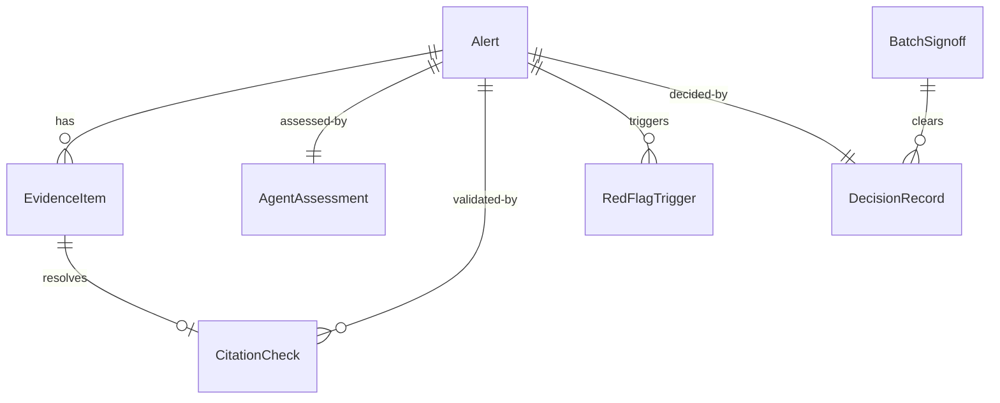

# Defensible AML Alert Triage ("Aurora Verdict") — Overview

**Discovery Brief:** docs/discovery/aml-triage/brief.md

## Summary

This epic delivers a triage process for anti-money-laundering (AML) alerts that makes
every escalate-or-close decision **defensible by construction**. Each alert flows through
a standardized orchestration that gathers the full evidence picture, produces a reasoned
recommendation with citations that are checked against real evidence, routes risk to the
right level of human review, and writes a complete, replayable audit record. It is built
for AML investigators and the supervisors and auditors who answer for those decisions
later.

## Background & Context

**Current state:**

- AML investigators receive transaction-monitoring alerts and must decide whether to
  escalate (file a suspicious-activity report / open an investigation) or close them.
- Evidence needed for that judgement is scattered across separate systems — customer
  due-diligence records, transaction history, sanctions and politically-exposed-person
  (PEP) screening, and adverse media. Assembling it consumes the time meant for judgement.
- When a decision is recorded, the rationale is typically a one-or-two-sentence
  close reason.

**Problem:**

- A thin recorded rationale does not hold up when a regulator or internal auditor reviews
  the decision months or years later. The reasoning, the evidence relied on, and the
  approval trail are not captured in a way that survives scrutiny.
- Because evidence-gathering is manual and slow, and because there is no consistent
  standard applied to every alert, outcomes vary by which analyst is on shift.
- The highest-volume risk — large numbers of low-risk alerts closed quickly with little
  documented oversight — is exactly where a missed suspicious activity is most costly and
  hardest to defend afterwards.

## Goals

- Produce, for every triaged alert, a structured rationale that states the call, the risk
  tier, the agent's confidence, and a list of cited evidence — where every citation has
  been confirmed to point at real, gathered evidence.
- Route each alert to a level of human review proportional to its risk, with humans
  remaining accountable for every disposition, including the low-risk bulk.
- Capture a complete, replayable trail for each decision — from alert received, through
  evidence gathered, recommendation made, human decision taken, to outcome logged.
- Prove the agent's reasoning is accurate and audit-defensible on a realistic dataset
  before committing to the full orchestration.

## Non-Goals

- **No use of real or anonymized-real customer data.** The demonstration uses a public
  synthetic dataset plus an engineered evidence layer. Production data handling is out of
  scope.
- **No broad external-system integration.** Evidence sources are engineered/mocked for the
  demonstration. Wiring multiple genuine external sources is explicitly deferred.
- **No replacement of the investigator's judgement.** The process produces a
  recommendation and the human decides; it never auto-files a regulatory report.
- **Deferred beats (ranked backlog, not committed for the submission):** a
  missing-evidence loop-back that re-fetches data and re-triages; a service-level-agreement
  timer that escalates undecided alerts; and a live adverse-media / notification connector.
  See Open Questions for rationale.

## Story Index

| Ticket | Story                                              | Spec                                                               | Type        | Status      | Dependencies         |
| ------ | -------------------------------------------------- | ----------------------------------------------------------------- | ----------- | ----------- | -------------------- |
| TBD    | Golden-set accuracy validation                     | [spec-golden-set-validation.md](spec-golden-set-validation.md)     | Technical   | Not Started | —                    |
| TBD    | Core triage slice (recommendation → sign-off → log)| [spec-core-triage-slice.md](spec-core-triage-slice.md)            | User-facing | Not Started | Golden-set validation |
| TBD    | Red-flag override & conservative tiering           | [spec-red-flag-override.md](spec-red-flag-override.md)             | User-facing | Not Started | Core triage slice    |
| TBD    | Maker–checker challenger on the high-risk path     | [spec-maker-checker-challenger.md](spec-maker-checker-challenger.md)| User-facing | Not Started | Core slice; Red-flag override |
| TBD    | Low-risk auto-disposition with batch sign-off & QA | [spec-low-risk-batch-signoff.md](spec-low-risk-batch-signoff.md)   | User-facing | Not Started | Core triage slice    |

## Shared Business Rules

These rules apply across every story and define the standard each alert is held to.

- **Three risk tiers, three routes.** Every alert is assigned **low**, **medium**, or
  **high** risk. Low risk is auto-dispositioned with human batch sign-off and sampled
  review; medium risk gets an agent recommendation that a human signs or overrides; high
  risk gets the agent recommendation, an independent challenger review, then senior /
  enhanced-due-diligence (EDD) sign-off.
- **Citations must be grounded.** The agent may cite only evidence items that were actually
  gathered into the case file. Every citation is checked against the gathered evidence; any
  citation that cannot be traced to a real evidence item is flagged for the human before
  they see the recommendation. An unverifiable citation never passes silently.
- **Conservative tiering — uncertainty escalates.** Deterministic red-flag triggers force
  the high-risk route regardless of what the agent concludes. A confidence floor sends
  anything the agent is not strongly confident is low risk up to a human. The system never
  resolves doubt downward.
- **Red-flag trigger list (any one forces the high-risk route):** a sanctions-list match on
  the customer or a counterparty; a politically-exposed-person (PEP) match; a structuring
  pattern (three or more transactions each just under the RM25,000 cash-transaction-report
  threshold within a 7-day window); a counterparty in a jurisdiction on the international high-risk
  call-to-action list; or an internal watchlist match.
- **Confidence floor for auto-disposition:** an alert may be auto-dispositioned as low risk
  only when the agent's confidence is at least 85%. Below 85%, it is routed to a human.
- **Every alert carries an audit-ready decision record** containing: the alert reference
  and date; the customer / account reference; the risk tier and the agent's confidence; the
  recommendation (escalate / close / send to EDD); the list of cited evidence with each
  item's source and citation-check status; any red-flag triggers that fired; the challenger
  outcome where applicable; the human decision (who, when, agreed or overridden, and the
  override reason); and the final disposition with its timestamp. The record reconstructs
  the full alert → evidence → recommendation → decision → outcome trail.
- **A human is accountable for every disposition**, including auto-dispositioned low-risk
  alerts (via batch sign-off and sampling). No alert is closed with no human in the chain.

## User Journey Map

> End-to-end experience across all five stories, from the investigator's and supervisor's
> perspective.

1. **An alert arrives.** A transaction-monitoring alert enters the queue. The process
   immediately assembles the evidence picture — customer profile, transaction history,
   screening results, adverse-media indicators — into one case file. _(Story: Core triage
   slice)_
2. **The risk is sorted.** Deterministic red-flag triggers and a confidence floor decide
   whether the alert must go to the high-risk route; otherwise the agent's risk tier
   stands. _(Story: Red-flag override & conservative tiering)_
3. **The investigator receives a reasoned recommendation.** For a medium-risk alert, the
   investigator opens a case that already states the call, the risk tier, the confidence,
   and the cited evidence — with any unverifiable citation already flagged. They sign or
   override, recording why. _(Story: Core triage slice)_
4. **High-risk alerts get a second opinion.** A challenger independently reviews the
   recommendation and either agrees or raises a documented disagreement before a senior /
   EDD reviewer makes the call. _(Story: Maker–checker challenger)_
5. **Low-risk volume stays accountable.** Low-risk alerts are auto-dispositioned, but a
   supervisor clears them in a single batch sign-off, with a sampled percentage (and all
   high-value alerts) pulled for full review. _(Story: Low-risk auto-disposition with batch
   sign-off & QA)_
6. **The decision is logged and defensible.** Whatever the route, a complete audit record
   is written. Anyone reviewing it later can reconstruct exactly what was known, what was
   recommended, who decided, and why. _(Story: Core triage slice)_
7. **Confidence is earned first.** Before any of this runs end-to-end, the agent's
   recommendations are scored against a realistic dataset with known answers, so the team
   knows the reasoning is accurate, not plausible-sounding. _(Story: Golden-set accuracy
   validation)_

## Success Metrics

- **Audit-readiness:** at least 90% of triaged alerts produce a full cited narrative (the
  call, the risk tier, and validated evidence citations) that passes a simple
  audit-readiness rubric — measured against today's one-line close reason.
- **Decision accuracy:** the agent's precision and recall on its risk-tier calls are
  reported as real numbers against the dataset's known answers, with at least 6 of 8
  curated golden-set scenarios passing all three rubric points (correct call, validated
  citations, would survive an audit).
- **Defensibility coverage:** 100% of dispositioned alerts — including auto-dispositioned
  low-risk alerts — have a named human accountable in the record.
- **Citation integrity:** zero unverifiable citations reach a human reviewer unflagged.
- **Time-to-defensible-decision:** investigators start from a complete, reasoned
  recommendation rather than a blank case file (qualitative, demonstrated).

## Dependencies

- **Public synthetic AML dataset** (SAML-D or the IBM Transactions for AML dataset) as the
  realistic substrate, with its license attributed. No real or anonymized-real data.
- **An engineered evidence layer** that assembles each alert's evidence bundle and injects
  synthetic sanctions / PEP indicators (the raw datasets contain none).
- **Monetary values are expressed in Malaysian ringgit (MYR)**, reflecting a Bank Negara
  Malaysia supervision context: the cash-transaction-report (CTR) threshold is RM25,000 and
  the high-value mandatory-review bar is RM250,000 (demonstration default). Dataset amounts
  are normalized into ringgit in the engineered layer.
- **Automation platform access** confirmed — the UiPath CLI is authenticated against
  Automation Cloud; the orchestration, human-review steps, and audit store depend on it.
  **Solo build (team size 1)** — scope discipline carries more weight than usual.
- **A curated golden set** of 8–12 scenarios drawn from the dataset, each engineered to
  exercise a specific route and demonstration beat.

## Rollout Strategy

- **Validate, then build a vertical slice.** The golden-set validation runs first to prove
  the agent's reasoning. Then one alert is taken fully end-to-end (gather → recommendation
  with validated citations → human sign-off → audit log) by a hard internal date.
- **Layer the beats in priority order** once the slice works: red-flag override, then the
  maker–checker challenger, then low-risk batch sign-off and sampling QA. Each is a ranked
  backlog item, not an unconditional commitment.
- **Feature-freeze near the end of the build window**, after which effort shifts to the
  demonstration narrative. Narrow-but-works beats broad-but-broken.

## Open Questions

> Resolve all questions before implementation. Non-blocking questions may be deferred with
> rationale.

- [x] ~~What exact fields make a decision record audit-ready?~~ — **Resolved:** the field
  set is fixed in Shared Business Rules above (alert reference, customer reference, tier,
  confidence, recommendation, cited evidence with check status, red-flag triggers,
  challenger outcome, human decision and override reason, final disposition and timestamp).
- [x] ~~What is the confidence-floor threshold and the red-flag trigger list?~~ —
  **Resolved:** auto-disposition requires ≥85% agent confidence; the red-flag list is the
  five triggers fixed in Shared Business Rules. These are demonstration defaults, tunable
  later.
- [x] ~~What is the minimum-viable challenger?~~ — **Resolved:** an independent review that
  agrees or raises a documented disagreement on the high-risk path before senior / EDD
  sign-off. Detailed in its story.
- [x] ~~Which evidence sources are real vs. mocked?~~ — **Resolved:** all evidence is
  engineered / mocked over the public dataset for the submission; a live adverse-media /
  notification connector is a deferred backlog beat.
- [x] ~~What accuracy bar does the agent have to clear?~~ — **Resolved:** at least 6 of 8
  golden-set scenarios pass all three rubric points; precision and recall are reported as
  real numbers without a hard pass threshold.
- [x] ~~Confirm automation-platform access and team size on day one~~ — **Resolved:**
  UiPath CLI is authenticated against Automation Cloud; solo build (team size 1). No
  blocking dependencies remain.
- [ ] Missing-evidence loop-back and service-level-agreement escalation timer — **Deferred
  (non-blocking):** valuable but build-heavy; included in the ranked backlog and layered
  only if the committed stories land with time to spare.

---

# Technical Architecture (Shared)

> This section is the **frozen contract** for every story in the epic. Each story spec adds
> only its story-specific technical sections and references the entities, schemas, and
> conventions defined here. Change it here once, not five times.
>
> **Platform decisions (with ADRs):** low-code Agent Builder agents
> ([ADR 001](../../adr/001-low-code-agent-builder-for-triage-and-challenger.md));
> API Workflow + Data Fabric for automation and the audit store
> ([ADR 002](../../adr/002-api-workflow-and-data-fabric-for-automation-and-audit-store.md));
> custom precision/recall scoring over agent eval exports
> ([ADR 003](../../adr/003-custom-precision-recall-scoring.md)); batch sign-off via a summary
> HITL task plus individual pull-outs
> ([ADR 004](../../adr/004-batch-signoff-modeling.md)); failure-handling posture
> ([ADR 005](../../adr/005-failure-handling-posture.md)).

## Component Map

| # | Component | UiPath product | Artifact | Responsibility |
| - | --------- | -------------- | -------- | -------------- |
| 1 | **Triage orchestration** | Maestro BPMN (`ProcessOrchestration`) | `TriageOrchestrationBpmn/TriageOrchestrationBpmn.bpmn` | The spine. Risk-tier gateway, agent task, deterministic-gate task, HITL tasks, audit-write task, plus a deferred SLA boundary-timer **stub** (not built — see deferred beats below). |
| 2 | **Triage agent** | Agent Builder (low-code) | `TriageAgent/agent.json` | LLM reasoning → `{risk_tier, confidence, recommendation, rationale, citations[]}` (structured output). |
| 3 | **Challenger agent** | Agent Builder (low-code) | `ChallengerAgent/agent.json` | Independent agree/disagree review on the high-risk path → `{position, disputed_point, reasoning, citations[]}`. |
| 4 | **Evidence-gather API Workflow** | API Workflow (`Api`) | `EvidenceGatherApi/EvidenceGather.json` | Read dataset row, assemble ID'd evidence bundle, inject synthetic sanctions/PEP, persist `Alert` + `EvidenceItem`s. |
| 5 | **Deterministic-gate API Workflow** | API Workflow (`Api`) | `DecisionGateApi/DecisionGate.json` | Citation validator + red-flag evaluation + confidence floor. No LLM. |
| 6 | **Audit-write API Workflow** | API Workflow (`Api`) | `AuditWriteApi/AuditWrite.json` | Write the `DecisionRecord` (+ `CitationCheck`, `RedFlagTrigger`, `BatchSignoff` rows). Append-only by convention. |
| 7 | **Human review** | Action Center (HITL) | `bpmn:userTask` nodes in the BPMN | Medium sign/override; high senior/EDD sign-off; low-risk batch + individual review. |
| 8 | **Case + audit store** | Data Fabric | entities (below) | Replayable case data and the audit-ready decision record. |
| 9 | **Deliverable bundle** | Solution | `AuroraVerdict/AuroraVerdict.uipx` | Packs components 1–6 + Data Fabric resources into one deployable `.uipx`. |

> **Out of technical scope (deferred beats):** missing-evidence loop-back, SLA escalation
> timer (a boundary `bpmn:timerEventDefinition` is left as a stub), and the live
> adverse-media / Integration Service connector. Not specced below.

## Repository & Solution Layout

```
uipath-hackathon/
├── AuroraVerdict/                       # solution root (uip solution init)
│   ├── AuroraVerdict.uipx               # solution manifest (project list + IDs)
│   ├── TriageOrchestrationBpmn/         # ProcessOrchestration project
│   │   ├── TriageOrchestrationBpmn.bpmn # MODEL-AUTHORED source of record
│   │   ├── project.uiproj
│   │   └── entry-points.json | bindings_v2.json | operate.json | package-descriptor.json   # CLI-derived
│   ├── TriageAgent/                     # agent.json (lowCode) + entry-points.json + evals/
│   ├── ChallengerAgent/                 # agent.json (lowCode)
│   ├── EvidenceGatherApi/               # API Workflow (type "Api")
│   ├── DecisionGateApi/
│   └── AuditWriteApi/
├── data/
│   ├── SAML-D.csv                       # public synthetic dataset (substrate)
│   └── evidence-overlay.json            # engineered sanctions/PEP/watchlist/jurisdiction overlay
├── golden-set/
│   ├── scenarios/                       # 8–12 curated cases + known-correct labels
│   └── score.py                         # custom precision/recall + rubric scorer (ADR 003)
└── docs/                               # specs, adr, discovery, poc (existing)
```

**Dataset default:** SAML-D (`berkanoztas/synthetic-transaction-monitoring-dataset-aml`),
single CSV, license confirmed on its Kaggle license tab before use. IBM Transactions for
AML (CDLA-Sharing-1.0) is a drop-in alternative — the engineered overlay isolates the rest
of the system from the choice. **No real or anonymized-real data.** Amounts normalized to MYR.

## Shared Data Model — Data Fabric entities

> Field types are the exact Data Fabric `EntityFieldDataType` (UPPERCASE). Every entity also
> has system fields `Id` (UUID, stable record identifier), `CreatedBy`, `CreateTime`,
> `UpdatedBy`, `UpdateTime`. Reserved names (`Status`, `Type`, `Case`, `User`, `Role`,
> `Order`, system-field names) are avoided. `CHOICE_SET_SINGLE` values are written by integer
> `NumberId`. Relationships store the parent record's `Id` UUID.

**`Alert`** — one incoming alert.
| Field | Type | Notes |
| ----- | ---- | ----- |
| `AlertReference` | STRING | unique business key, e.g. `ALERT-2026-0142` |
| `AlertDate` | DATE | |
| `CustomerReference` | STRING | |
| `CustomerName` | STRING | demo value, e.g. `Meridian Trading Ltd` |
| `AccountReference` | STRING | |
| `AggregateAmountMYR` | DECIMAL | for the high-value threshold |

**`EvidenceItem`** — one ID'd item in the bundle (the citation target).
| Field | Type | Notes |
| ----- | ---- | ----- |
| `EvidenceId` | STRING | **stable citation ID**, e.g. `ALERT-2026-0142#EV-003`, unique |
| `AlertLink` | RELATIONSHIP → `Alert` | |
| `EvidenceCategory` | CHOICE_SET_SINGLE | `customer_profile` / `transaction_history` / `screening` / `adverse_media` |
| `Summary` | MULTILINE_TEXT | human-readable |
| `SourceRef` | STRING | where it came from |
| `PayloadJson` | MULTILINE_TEXT | structured detail (JSON-as-text; `FILE` upload via CLI is broken) |
| `IsNoResult` | BOOLEAN | explicit "no result" (e.g. no adverse media) vs missing |

**`AgentAssessment`** — the agent's recommendation (the "maker").
| Field | Type | Notes |
| ----- | ---- | ----- |
| `AlertLink` | RELATIONSHIP → `Alert` | |
| `ProposedRiskTier` | CHOICE_SET_SINGLE | `low` / `medium` / `high` |
| `Confidence` | INTEGER | 0–100 (bound prompt-enforced, validated by the gate) |
| `Recommendation` | CHOICE_SET_SINGLE | `escalate` / `close` |
| `Rationale` | MULTILINE_TEXT | |
| `CitedEvidenceIds` | MULTILINE_TEXT | JSON array of `EvidenceId` strings |
| `ModelName` | STRING | model used (provenance) |

**`CitationCheck`** — per-citation validator outcome.
| Field | Type | Notes |
| ----- | ---- | ----- |
| `AlertLink` | RELATIONSHIP → `Alert` | |
| `CitedEvidenceId` | STRING | the id the agent cited |
| `CheckOutcome` | CHOICE_SET_SINGLE | `verified` / `unverified_flagged` |
| `ResolvedEvidenceLink` | RELATIONSHIP → `EvidenceItem` | null when unverified |

**`RedFlagTrigger`** — one row per trigger that fired.
| Field | Type | Notes |
| ----- | ---- | ----- |
| `AlertLink` | RELATIONSHIP → `Alert` | |
| `TriggerKind` | CHOICE_SET_SINGLE | `sanctions` / `pep` / `structuring` / `jurisdiction` / `watchlist` |
| `TriggerDetail` | STRING | e.g. `Sanctions match on counterparty Volkov Holdings` |

**`DecisionRecord`** — the audit-ready record (append-only by convention).
| Field | Type | Notes |
| ----- | ---- | ----- |
| `AlertLink` | RELATIONSHIP → `Alert` | |
| `FinalRiskTier` | CHOICE_SET_SINGLE | `low` / `medium` / `high` |
| `TierWasForced` | BOOLEAN | red flag forced the tier |
| `OriginalProposedTier` | CHOICE_SET_SINGLE | the agent's tier before override |
| `RouteTaken` | CHOICE_SET_SINGLE | `low_batch` / `medium_signoff` / `high_challenger` |
| `ChallengerOutcome` | CHOICE_SET_SINGLE | `not_applicable` / `agreed` / `disagreed` |
| `ChallengerDispute` | MULTILINE_TEXT | null unless disagreed |
| `DecisionMakerName` | STRING | accountable human |
| `HumanAction` | CHOICE_SET_SINGLE | `signed_agree` / `override` |
| `OverrideReason` | MULTILINE_TEXT | required when `override` |
| `DecisionTimestamp` | DATETIME_WITH_TZ | |
| `FinalDisposition` | CHOICE_SET_SINGLE | `closed` / `escalated` / `sent_to_edd` |
| `DispositionTimestamp` | DATETIME_WITH_TZ | |
| `BatchSignoffLink` | RELATIONSHIP → `BatchSignoff` | null unless low-risk batch |
| `WasPulledForReview` | BOOLEAN | sampled or high-value individual review |

**`BatchSignoff`** — one low-risk batch clearance.
| Field | Type | Notes |
| ----- | ---- | ----- |
| `BatchReference` | STRING | unique, e.g. `BATCH-2026-03-14` |
| `SignoffTimestamp` | DATETIME_WITH_TZ | |
| `SignerName` | STRING | accountable supervisor |
| `AlertCount` | INTEGER | total in batch |
| `SampleRatePct` | INTEGER | 5 (demo default) |
| `SampledCount` | INTEGER | rounded up, ≥1 when non-empty |
| `HighValueCount` | INTEGER | always-pulled count |



## Shared Contracts

### Evidence-bundle + ID-only citation contract (the heart of "defensible by construction")

1. `EvidenceGather` assigns every gathered item a **stable `EvidenceId`** and returns the
   bundle to the agent as the agent's input.
2. The triage and challenger agents may populate `citations[]` **only** with `EvidenceId`s
   present in the supplied bundle (enforced by the system prompt's output contract).
3. The deterministic `DecisionGate` validator (a `JsInvoke` step) checks **every** cited id
   against the bundle: present → `verified`; absent → `unverified_flagged`. The result is one
   `CitationCheck` row per cited id, surfaced to the human **before** they read the
   recommendation. An unverifiable citation never passes silently.

### Triage agent I/O (`TriageAgent/agent.json` → `outputSchema`)

Input: `{ alert_reference, customer_name, evidence_bundle: [{ evidence_id, category, summary, payload }] }`
Output (structured):
```json
{
  "risk_tier": "low | medium | high",
  "confidence": 78,
  "recommendation": "escalate | close",
  "rationale": "Layered outbound payments consistent with normal trade settlement; no screening hits.",
  "citations": ["ALERT-2026-0142#EV-001", "ALERT-2026-0142#EV-004"]
}
```

### Challenger agent I/O (`ChallengerAgent/agent.json` → `outputSchema`)

Input: triage output **plus** the same `evidence_bundle`. Output (structured):
```json
{
  "position": "agreed | disagreed",
  "disputed_point": "The RM2,000,000 moved through three intermediary accounts in four days is unexplained by the cited evidence.",
  "reasoning": "...",
  "citations": ["ALERT-2026-0142#EV-002"]
}
```

### Deterministic gate (`DecisionGateApi`) outputs

```json
{
  "validated_citations": [{ "evidence_id": "...#EV-001", "outcome": "verified" }],
  "red_flags": [{ "kind": "structuring", "detail": "3 deposits under RM25,000 in 7 days" }],
  "final_risk_tier": "high",
  "tier_was_forced": true,
  "route": "high_challenger"
}
```

Gate rules (deterministic, no LLM):
- **Red-flag triggers** (any one ⇒ `high`, overriding the agent's tier): sanctions match
  (customer or counterparty); PEP match; **structuring** = ≥3 transactions each in
  `[RM22,500, RM25,000)` within any 7-day window; counterparty in a high-risk
  call-to-action jurisdiction; internal watchlist match.
- **Confidence floor:** a `low` call may stay `low` only if `confidence ≥ 85`; below 85 →
  route to a human (medium path). `≥ 85` includes exactly 85.
- **High-value:** `AggregateAmountMYR ≥ 250000` is always pulled for individual review in the
  low-risk batch (see the low-risk story).

### Engineered evidence overlay (`data/evidence-overlay.json`) — authoritative schema

The raw dataset has no sanctions/PEP/jurisdiction/watchlist/adverse-media signals, so they
are injected by this overlay. This is the **single source of truth** for the overlay's shape;
`EvidenceGather` produces it into the bundle and `DecisionGate`'s detectors consume it — they
must agree on these exact keys. All entries are **synthetic** (no real persons/entities).

```json
{
  "version": "1.0",
  "overlays": [
    {
      "match": { "customer_reference": "CUST-00231" },
      "sanctions_match":       [ { "entity": "Volkov Holdings", "role": "counterparty", "list": "OFAC SDN (synthetic)" } ],
      "pep_match":             [ { "entity": "Hassan Farouk", "role": "beneficial_owner", "position": "Deputy Minister (synthetic)" } ],
      "high_risk_jurisdiction":[ { "counterparty": "Sable Logistics", "jurisdiction": "Northland (synthetic FATF call-to-action)" } ],
      "watchlist_match":       [ { "entity": "CUST-00231", "list": "Internal watchlist (synthetic)" } ],
      "adverse_media":         [ { "headline": "...", "url": "synthetic://...", "date": "2024-07-01" } ]
    }
  ]
}
```

- **Match precedence:** an overlay entry is bound to an alert by `customer_reference`
  (preferred), else `customer_name`, else `alert_reference`. Exactly one overlay entry per
  alert; no match ⇒ all screening categories are "no result".
- **Each of the five arrays is optional/empty** = no signal of that kind.
- **`EvidenceGather` emits:** one `screening` `EvidenceItem` per `sanctions_match` / `pep_match`
  / `high_risk_jurisdiction` / `watchlist_match` entry (the entry object becomes `PayloadJson`);
  an explicit `IsNoResult` `screening` item when none fired; and `adverse_media` `EvidenceItem`s
  (or an `IsNoResult` adverse-media item).
- **`DecisionGate` detectors read by key:** `Detect_Sanctions` → `sanctions_match`;
  `Detect_PEP` → `pep_match`; `Detect_Jurisdiction` → `high_risk_jurisdiction`;
  `Detect_Watchlist` → `watchlist_match`. (`Detect_Structuring` is computed from the
  `transaction_history` evidence, **not** the overlay.)

### HITL task baseline (Action Center QuickForm, authored in the `.bpmn`)

All review tasks present read-only context fields (recommendation, tier, confidence, and the
`CitationCheck` results with any `unverified_flagged` warning) and capture a decision via
`outcomes[]`. Per-story specifics (sign/override, agree/disagree, batch approve) are in each
story.

## Shared Error / Outcome Catalogue

These are the **canonical** codes and message strings; per-story tables reference them rather
than restating the message text.

| Code | Message (user/operator-facing) | Surfaced where |
| ---- | ------------------------------ | -------------- |
| `CITATION_UNVERIFIED` | "Cited evidence '\<evidence_id\>' was not found in the gathered case file and cannot be relied on." | `CitationCheck.CheckOutcome = unverified_flagged`; shown to the human before they read the recommendation |
| `OVERRIDE_REASON_REQUIRED` | "An override reason is required before the override can be recorded." | Medium/high HITL |
| `TIER_FORCED_HIGH` | "Risk tier forced to HIGH by a red-flag trigger; the agent's proposed tier was overridden." | `DecisionRecord.TierWasForced = true` |
| `CONFIDENCE_BELOW_FLOOR` | "Low-risk call below the 85% confidence floor; routed to a human." | Gate routing |
| `BATCH_SIGNOFF_BLOCKED` | "Cannot sign off: \<n\> pulled alert(s) still need review." | Batch summary HITL |
| `EVIDENCE_NO_RESULT` | "No \<category\> evidence found (explicit no-result, not missing)." | `EvidenceItem.IsNoResult = true` |
| `WORKFLOW_STEP_FAILED` | "Step '\<name\>' failed: \<detail\>. Instance flagged as an incident for re-run." | API Workflow `TryCatch` → `Response(markJobAsFailed)`; raised as a Maestro incident ([ADR 005](../../adr/005-failure-handling-posture.md)) |
| `DUPLICATE_WRITE_SKIPPED` | "Record for '\<business_key\>' already exists; insert skipped (idempotent re-run)." | `EvidenceGather` / `AuditWrite` / `BatchPartition` idempotency guard ([ADR 005](../../adr/005-failure-handling-posture.md)) |

## Cross-cutting Threat Model

- **Data classification:** No PII / no real customer data — public synthetic dataset +
  engineered overlay only (epic Non-Goals). Synthetic sanctions/PEP names are fictional.
- **Attack surface:** New Action Center task forms (human input), API Workflow inputs, and
  the agent prompt (LLM). The agent runs behind a deterministic gate, so a manipulated or
  hallucinated agent output cannot force a *downward* disposition — red flags and the
  confidence floor only ever escalate.
- **Prompt injection:** Synthetic evidence text is attacker-controlled in principle; enable
  the `prompt_injection` and `user_prompt_attacks` built-in guardrails on both agents (run
  `uip agent guardrails list` first to confirm `Available`). The citation validator is the
  hard backstop — the LLM cannot introduce evidence that isn't in the bundle.
- **Authn/authz:** UiPath Automation Cloud identity for all `uip` operations; Action Center
  tasks assigned to named users/groups. No new public routes. (Demo runs in one tenant/folder.)
- **Dependency additions:** the Data Fabric Integration Service connector
  (`uipath-uipath-dataservice`); the public dataset (license attributed). No third-party
  packages beyond the UiPath platform and a Python stdlib scoring script.

## Global Negative Constraints

- Do **not** let the LLM decide red flags, the confidence floor, or citation validity —
  those are deterministic (`DecisionGateApi`) by design.
- Do **not** use real or anonymized-real data anywhere.
- Do **not** auto-file a regulatory report — the system recommends; a human disposes.
- Do **not** hand-edit `bindings_v2.json`, `entry-points.json`, `operate.json`, or
  `package-descriptor.json` — they are CLI-derived (`uip … refresh` / `uip solution resources refresh`).
- Do **not** `update` or `delete` `DecisionRecord` rows — append-only by convention.
- Do **not** name Data Fabric fields with reserved words (`Status`, `Type`, `Case`, `User`,
  `Role`, `Order`, system-field names).

## Build & Deploy Sequence (uip CLI)

Probe the CLI verb once: `uip solution init --help --output json` (if `unknown command`,
use `uip solution new` and `--folder-path`/`--folder-key`).

1. `uip solution init "AuroraVerdict" --output json`
2. `uip agent init "AuroraVerdict/TriageAgent" --output json` · same for `ChallengerAgent`
3. Create the API Workflow projects and `uip solution project add ./AuroraVerdict/<Proj>` for each
4. Author the `.bpmn`, `agent.json` × 2, and the three `*.json` API Workflows
5. Define Data Fabric entities: `uip df entities create "<Name>" --body '{...}' --output json` (7 entities above)
6. Local checks: `uip agent validate`, `uip api-workflow validate <file>`, `uip maestro bpmn validate <bpmn>`
7. `uip solution resources refresh --output json` (reconcile bindings)
8. `uip solution pack ./AuroraVerdict ./output -v <ver> --output json`
9. `uip solution publish ./output/AuroraVerdict.<ver>.zip --output json`
10. `uip solution deploy run -n "AuroraVerdict" --package-name "AuroraVerdict" --package-version "<ver>" --folder-name "AuroraVerdict" --output json`

Agent evals (golden set) are cloud-based and need `uip solution upload ./AuroraVerdict` first.

## Platform / Runtime Prerequisites

- UiPath Automation Cloud authenticated via `uip` (confirmed); one tenant + one folder for the demo.
- Tool floors: `@uipath/data-fabric-tool` ≥ 0.9.0 (CRUD/import); `@uipath/api-workflow-executor` for `uip api-workflow run`.
- Python 3 (stdlib only) for `golden-set/score.py`.
- Studio Web access for agent eval runs and Maestro debug.

## Resilience & Failure Handling

Posture is **idempotent re-run, no saga/compensation** in demo scope
([ADR 005](../../adr/005-failure-handling-posture.md)). Applies to every API Workflow and the
BPMN spine:

- **Idempotency by business key.** Data Fabric has no upsert, so every insert is guarded in a
  `JsInvoke` step: **query-by-key first, insert only if absent** (`Alert.AlertReference`,
  `EvidenceItem.EvidenceId`, `BatchSignoff.BatchReference`, one `DecisionRecord` per
  `AlertLink`). A guarded skip emits `DUPLICATE_WRITE_SKIPPED`. Re-running a step never
  double-writes.
- **Bounded failure per workflow.** Each API Workflow wraps its multi-entity write in
  `TryCatch`; an uncaught error returns a hard-fail `Response` with `markJobAsFailed` and a
  `WORKFLOW_STEP_FAILED` payload, surfaced as a Maestro **incident**.
- **Recovery = re-run the instance.** Idempotent writes make a re-run of `EvidenceGather`
  reconcile a partial write rather than duplicate it. The gate and audit-write run only after
  a successful gather, so a partial gather never yields a half-formed decision record.
- **No auto-retry.** Failures raise an incident for manual re-run; diagnose with
  `uip maestro bpmn instance incidents <id> -f <folder>` and `uip maestro bpmn job traces <jobKey>`.
- Each story's Functional Requirements already assert step idempotency; this is the shared
  mechanism behind that.

## Audit Replay (orchestration + record)

"Replayable" is delivered by **two complementary surfaces** — cite both in the demo:

1. **Record-level (durable, business-readable).** The `DecisionRecord` plus its linked
   `Alert` / `EvidenceItem` / `CitationCheck` / `RedFlagTrigger` / `BatchSignoff` rows
   reconstruct the full *alert → evidence → recommendation → decision → outcome* trail from
   Data Fabric. Query via `uip df records query <entity-id> --body '{...}'`. This is the
   artifact an auditor reads months later.
2. **Orchestration-level (step-by-step execution evidence).** Every Maestro run produces a
   full execution trace: which gateway branch was taken, each service/agent/HITL task's
   inputs and outputs, timestamps, and who acted at each HITL step. Inspect with
   `uip maestro bpmn instance get <instanceId> -f <folderKey>`,
   `uip maestro bpmn job traces <jobKey>`, and `uip maestro bpmn instance incidents`. This is
   the orchestration backbone of the "replayable trail" claim and a core **Track 2 / Maestro
   platform-usage** talking point.

The Data Fabric record is the durable audit artifact; the Maestro trace is the live
execution evidence. Neither alone is the whole story.

## Submission & Platform-Usage Deliverables

> Owns the scored **"Built with Claude Code" / Platform Usage bonus** from the discovery
> brief. These are submission artifacts produced *alongside* the feature build (not a feature
> story); track them in the build phase and freeze them at the ~Jun 27 feature-freeze.

| Deliverable | Path / form | Purpose |
| ----------- | ----------- | ------- |
| **"Built with Claude Code" section** | `AGENTS.md` (repo root) | Lists the actual `uip` commands Claude Code ran (scaffold → author → entities → pack → publish → deploy), linking the build log — the named bonus is for the *coding* agent driving `uip`. |
| **README** | `README.md` (repo root) | Project summary, the core-5 component map, how to run, and a "Built with Claude Code" subsection. |
| **Build/command log** | `docs/build-log.md` | Committed chronological log of the `uip` commands executed — the proof, in repo content. |
| **Deck slide** | (deliverable) | One slide on the Claude-Code build path. |
| **Video clip** | (deliverable) | ~15–20s of Claude Code driving `uip` — proof, not theatre. |

- **Constraint:** **no `Co-Authored-By` commit trailers** — the evidence lives in repo content
  and the video, not commit metadata.
- **Platform-usage breadth:** the core-5 components (Maestro BPMN, Agent Builder ×2, API
  Workflow, Action Center, Data Fabric) are all load-bearing — see the Component Map. Avoid
  token integrations.
- **Optional second layer:** the in-flow triage/challenger agents may run on a Claude model via
  UiPath — reinforces the story, but the *named* bonus is the coding agent.
